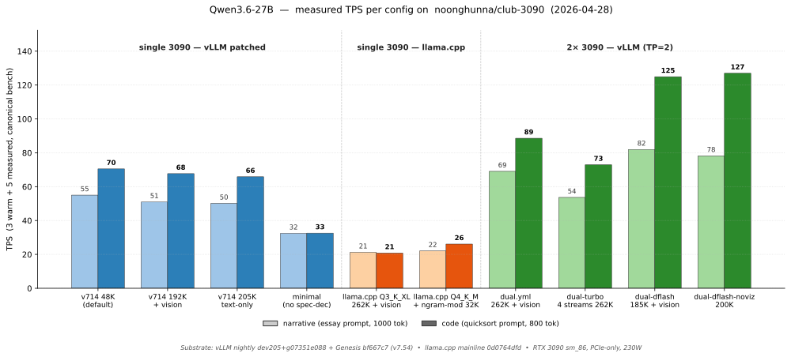

# club-3090

**Recipes for serving LLMs locally on RTX 3090s.** Multi-engine (vLLM, llama.cpp, SGLang), multi-model, model-agnostic by design.

If you have one or two RTX 3090s and want to run modern LLMs at home, in a homelab, or as a dev backend — this repo collects the working configs, patches, and benchmarks.

---

## TL;DR — what this is

- **Validated docker compose configs** for serving big models on consumer 24 GB GPUs
- **Drop-in OpenAI-compatible API** — point any OpenAI SDK at `localhost:8020`
- **All the features** — chat, vision, tool calling, streaming, reasoning mode, speculative decoding (where supported)
- **Multi-engine**: pick vLLM (full features) / llama.cpp (max context, lighter footprint) / SGLang (high-throughput multi-tenant — currently blocked, watch list)
- **Multi-card**: configs for both single-3090 and dual-3090 setups
- **Model-agnostic**: today ships configs for Qwen3.6-27B; structure scales as we add models

**First time here?** → [Models](#supported-models) — pick yours.
**Already running, want to compare engines?** → [docs/engines/](docs/engines/)
**Hardware questions** (does this work on a 4090, do I need NVLink)? → [docs/HARDWARE.md](docs/HARDWARE.md)
**Don't know what TPS / KV / MTP mean?** → [docs/GLOSSARY.md](docs/GLOSSARY.md)

---

## Supported models

Each model has its own subdirectory with engine-specific composes / recipes / patches and per-model docs.

| Model | Status | Card counts | Engines | Highlights |
|---|---|---|---|---|
| **[Qwen3.6-27B](models/qwen3.6-27b/)** | Production-ready ⭐ | 1× / 2× 3090 | vLLM ✅ · llama.cpp ✅ · SGLang ❌ blocked | Vision · tools · MTP n=3 · 48K-262K context · 51-89 TPS depending on config |

More models coming. The repo structure scales — when we add Qwen3.5-27B / GLM-4.6 / etc., they go under `models/<name>/` with the same internal pattern.

---

## Measured TPS at a glance



Bench protocol: 3 warm + 5 measured runs of the canonical narrative + code prompts. Substrate: vLLM nightly `dev205+g07351e088` + Genesis pinned to commit `bf667c7` (v7.54), llama.cpp mainline `0d0764dfd`, RTX 3090 sm_86 PCIe-only at 230 W. Per-config details + run-by-run numbers + VRAM + AL/accept rates: [models/qwen3.6-27b/CHANGELOG.md](models/qwen3.6-27b/CHANGELOG.md) (per-model history) and [scripts/bench.sh](scripts/bench.sh) (canonical bench).

---

## Quick start (for the current model — Qwen3.6-27B on vLLM)

```bash
# 1. Clone the repo
git clone https://github.com/noonghunna/club-3090.git
cd club-3090

# 2. Download + SHA-verify the model (~20 GB; clones Genesis patches too)
bash scripts/setup.sh qwen3.6-27b

# 3. Boot the default config (single-card vLLM, 48K context, full features)
cd models/qwen3.6-27b/vllm/compose && docker compose up -d

# 4. Watch it come up (~2 min for cold compile)
docker logs -f vllm-qwen36-27b
# Wait for "Application startup complete"

# 5. Sanity test
curl -sf http://localhost:8020/v1/chat/completions \
  -H "Content-Type: application/json" \
  -d '{"model":"qwen3.6-27b-autoround","messages":[{"role":"user","content":"Capital of France?"}],"max_tokens":30}'

# 6. Run the canonical benchmark
cd /opt/ai/github/club-3090 && bash scripts/bench.sh
```

For dual-card setups, opt into `docker-compose.dual.yml` (or one of the dual variants) — see [models/qwen3.6-27b/vllm/](models/qwen3.6-27b/vllm/).

For llama.cpp (different engine, different recipe — useful for max context on single-card):
```bash
cd models/qwen3.6-27b/llama-cpp && cat README.md
```

---

## Repo layout

```
club-3090/
├── README.md                              this file — start here
├── CHANGELOG.md                           cross-cutting changes (engine pin bumps, script updates)
├── LICENSE                                Apache-2.0
├── docs/
│   ├── ARCHITECTURE.md                    how this stack thinks about LLM serving on 24 GB
│   ├── HARDWARE.md                        Ampere SM 8.6+, NVLink note, 24 GB ceilings
│   ├── GLOSSARY.md                        plain-language definitions (TPS / KV / MTP / TP / etc.)
│   ├── img/                               cross-model illustrations (vram-budget.svg)
│   └── engines/                           cross-model engine comparison + per-engine deep dives
│       ├── README.md                      decision tree, pros/cons matrix
│       ├── VLLM.md                        vLLM general docs + tuning
│       ├── LLAMA_CPP.md                   llama.cpp general docs + 262K recipe
│       └── SGLANG.md                      blocked status + watch list
├── models/
│   └── qwen3.6-27b/                       all Qwen3.6-27B-specific stuff
│       ├── README.md                      model overview + variants + recommendations
│       ├── INTERNALS.md                   model-specific bugs (DeltaNet cliffs, Genesis patches, MTP head, Marlin pad)
│       ├── USE_CASES.md                   per-workload guides (1× and 2× combined)
│       ├── CHANGELOG.md                   model-specific dated history
│       ├── vllm/
│       │   ├── README.md                  "vLLM recipes for Qwen3.6-27B"
│       │   ├── compose/                   docker-compose files (single-card + dual-card variants)
│       │   └── patches/                   tolist_cudagraph + Marlin pad README + Genesis pointer
│       ├── llama-cpp/
│       │   ├── README.md                  "llama.cpp recipes for Qwen3.6-27B"
│       │   └── recipes/                   single-card 65K + 262K-max-ctx + dual-card recipes
│       └── sglang/
│           └── README.md                  blocked status — what would unblock it on this model
└── scripts/                               shared, model-aware
    ├── setup.sh                           bash setup.sh <model> → downloads + verifies + clones engine patches
    ├── verify.sh                          quick smoke test (engine-aware via env)
    ├── verify-full.sh                     fast functional test (8 checks, ~1-2 min)
    ├── verify-stress.sh                   boundary-case stress test (longctx ladder + tool prefill OOM, ~5-10 min)
    └── bench.sh                           canonical TPS bench
```

---

## What you'll need

| For any model on this stack | Notes |
|---|---|
| 1× or 2× NVIDIA RTX 3090 (24 GB each) | Larger Ampere/Ada cards (4090, A6000) work; smaller cards (12 GB) don't fit 27B-class models. |
| Linux (Ubuntu 22.04+ tested) | macOS/Windows: vLLM is Linux + CUDA only. Llama.cpp works on macOS/Windows but recipes assume Linux paths. |
| Docker + NVIDIA Container Toolkit | For vLLM. llama.cpp works without Docker. |
| NVIDIA driver 580.x+ | For CUDA 13 runtime in vLLM nightly. |
| ~30 GB free disk | Per model. More for multiple models. |

See [docs/HARDWARE.md](docs/HARDWARE.md) for hardware-specific notes (PCIe vs NVLink, power draw, etc.).

---

## How this is structured

**Engines and hardware are general** — the docs in `docs/` apply across models. vLLM works the same way regardless of whether you're serving Qwen, GLM, or Llama; the engine docs cover that once.

**Models are specific** — under `models/<name>/`, you find that model's quants, quirks, recommended configs, and engine-specific recipes. Adding a new model means adding a new subdir with the same internal pattern.

**Scripts are shared but model-aware** — `bash scripts/setup.sh qwen3.6-27b` downloads the right model + clones the right patches. When we add another model, you'd run `bash scripts/setup.sh glm-4.6` and the same script handles it.

This separation keeps the stack maintainable as it grows. We don't want a model-specific README at the top; we want the top to be "stack docs" and the model details under their dedicated subdirs.

---

## Migration history

- **2026-04-28** — Repo created. Consolidates and supersedes:
  - [`noonghunna/qwen36-27b-single-3090`](https://github.com/noonghunna/qwen36-27b-single-3090) (single-card recipe; archived for issue history)
  - [`noonghunna/qwen36-dual-3090`](https://github.com/noonghunna/qwen36-dual-3090) (dual-card recipe; archived for issue history)

  Old repos remain readable for existing issue threads, external links (Medium articles, Reddit posts), and historical context. New issues should be filed here.

See [CHANGELOG.md](CHANGELOG.md) for the merged dated history.

---

## Credits

The stack stands on a lot of shoulders:

- **Qwen team** ([@Alibaba_Qwen](https://huggingface.co/Qwen)) — for the base models and the MTP head architecture
- **[Lorbus](https://huggingface.co/Lorbus/Qwen3.6-27B-int4-AutoRound)** — for the AutoRound INT4 quant with preserved BF16 `mtp.fc` (the model this whole stack runs on)
- **[Sandermage](https://github.com/Sandermage/genesis-vllm-patches)** — Genesis patch tree for TurboQuant + hybrid models on consumer Ampere; root-causing #40880 and shipping the v7.14 fix
- **[vibhavagarwal5](https://github.com/vllm-project/vllm/pull/38479)** — TurboQuant landing PR + tracking issue #40069
- **[vLLM project](https://github.com/vllm-project/vllm)** — the engine + active maintenance
- **[llama.cpp](https://github.com/ggerganov/llama.cpp)** — the alternative engine path
- **[Luce z-lab](https://github.com/luce-spec)** — DFlash N=5 draft model for Qwen3.6-27B
- **Intel AutoRound** — quantization framework
- **All cross-rig contributors** — [@ampersandru](https://github.com/ampersandru), [@walmis](https://github.com/walmis), [@3dluvr](https://github.com/3dluvr), and the Reddit / X local-LLM community for benchmark data and bug reports.

---

## License

Apache 2.0. Do what you want with it. If you get better numbers on your rig — open an issue. If you add a new model with working configs — open a PR.
