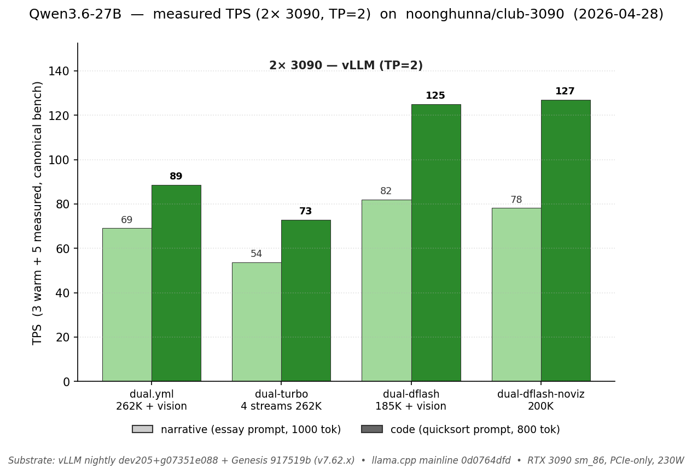
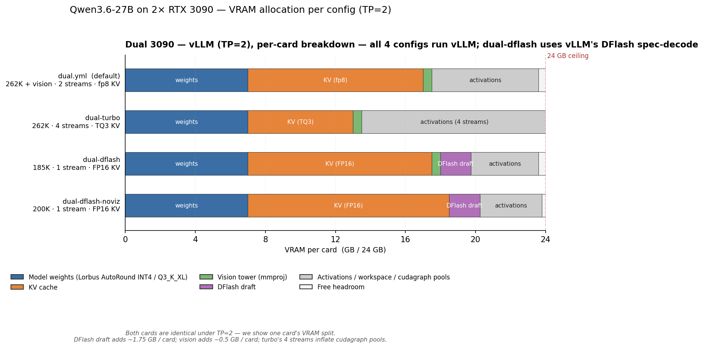

# Dual 3090 — what changes when you add the second card

You have **2× RTX 3090s, PCIe-only (no NVLink)**. This page is the front door for picking a config and knowing what dual-card unlocks vs single. Model-specific deep dives (quants, Genesis, engine internals) live in the model directory — links at the bottom.

---

## TL;DR — pick by workload

| What you're doing | Compose | Max ctx | Narr / Code TPS | VRAM per card | Why |
|---|---|---|---|---|---|
| General-purpose default (vision + tools + long ctx) | [`dual.yml`](../models/qwen3.6-27b/vllm/compose/docker-compose.dual.yml) ⭐ | **262K** (237K single-prompt verified) | **69 / 89** | ~23.6 / 24 GB | fp8 KV, 2 streams, full feature set |
| Multi-tenant (4 concurrent agents at full ctx) | [`dual-turbo.yml`](../models/qwen3.6-27b/vllm/compose/docker-compose.dual-turbo.yml) | **262K** | **54 / 73** per-stream (≈ 212/292 aggregate) | ~24 / 24 GB | TQ3 KV (3 bits/token) frees room for 4 streams |
| Peak code TPS with vision | [`dual-dflash.yml`](../models/qwen3.6-27b/vllm/compose/docker-compose.dual-dflash.yml) | **185K** | **82 / 125** | ~23.6 / 24 GB | DFlash N=5 + 1.75 GB draft per card, AL ~4.4 (vs MTP's 3.4) |
| Peak code TPS, no vision | [`dual-dflash-noviz.yml`](../models/qwen3.6-27b/vllm/compose/docker-compose.dual-dflash-noviz.yml) | **200K** | **78 / 127** | ~23.8 / 24 GB | DFlash + no vision, +15K ctx vs dual-dflash |

> **VRAM column is per-card** under TP=2 (each card holds half the weights + half the KV; both cards' totals are nearly identical). For a 2× 20 GB rig (e.g. 2× 3080-20GB / 40 GB combined), `dual.yml` and `dual-turbo` should fit; `dual-dflash*` won't (FP16 KV + DFlash draft pushes per-card past 20 GB). Component breakdown in [`tools/charts/gen-vram.py`](../tools/charts/gen-vram.py).

Run any of these via `bash scripts/launch.sh` (interactive) or `bash scripts/switch.sh <variant>`.

---

## Measured TPS on 2× 3090



Bench protocol: 3 warm + 5 measured runs of the canonical narrative + code prompts on each config. Substrate: vLLM nightly `dev205+g07351e088` + Genesis pinned to `917519b` (v7.62.x), RTX 3090 sm_86 PCIe-only at 230 W. Per-config run-by-run + VRAM peaks: [models/qwen3.6-27b/CHANGELOG.md](../models/qwen3.6-27b/CHANGELOG.md).

---

## VRAM budget on 2× 24 GB (TP=2)



**Tensor parallelism (TP=2) splits weights AND KV symmetrically across both cards.** Each card holds ~7 GB of weights (vs ~14 GB on single-card) plus its half of the KV pool. That's why dual unlocks what single can't:

- 262K context + vision + 2 streams fits at ~23.6 GB / card on `dual.yml` (would need ~33 GB on a hypothetical single-card)
- DFlash draft adds ~1.75 GB / card (manageable across two cards; would crowd out KV on single)
- 4 concurrent streams via `dual-turbo` use TQ3 KV's compactness to fit 4 × full-context KV pools

For the single-card picture, see [`SINGLE_CARD.md`](SINGLE_CARD.md).

---

## Pick a config

### General default — `dual.yml`

**Workload:** anything. Chat, tool agents, vision, mixed-modal. The recommended default for 2× 3090.

262K context, fp8 KV, MTP n=3, 2 streams, vision tower active. **Genesis-less by design** — fp8 KV doesn't trigger the cudagraph bug (#40880) that drove Genesis's existence on single-card. Pure vLLM nightly path. Tool calls work via `--tool-call-parser qwen3_coder` + `--enable-auto-tool-choice`. All `verify-stress.sh` checks pass clean.

**When to pick:** the obvious starting point. Unless one of the specialized variants below names your exact workload, this is right.

### Multi-tenant — `dual-turbo.yml`

**Workload:** small team or agent farm running 2-4 concurrent sessions. Open WebUI multi-user, GitHub-Actions-with-AI-PRs flows, batch agent runs.

262K + **TurboQuant 3-bit KV** + Genesis patches + 4 streams. TQ3 packs each KV slot to ~3 bits/token (vs fp8's ~8 bits), which is what makes 4 × 262K pools fit on 2 cards. ~25% per-stream TPS regression vs `dual.yml` (54/73 vs 69/89), but **aggregate throughput across 4 streams is 4× higher** (~212/292 TPS combined).

**When to pick:** real concurrent load. Solo users won't see the win — `dual.yml`'s single-stream is faster. Pick this only if you actually have 2+ simultaneous requests on the regular.

### Peak code TPS, with vision — `dual-dflash.yml`

**Workload:** code-heavy single-stream — fast iteration on quicksort-class problems, Cline going through a codebase, Cursor doing inline completions in a heavy file.

185K context (vs 262K — DFlash's draft model takes ~1.75 GB / card), FP16 KV (forced — DFlash's non-causal head_size=256 path requires fp16), DFlash N=5 draft model from Luce z-lab. **Code TPS lands at 125** vs `dual.yml`'s 89 — a real 40% jump on code prompts thanks to DFlash's higher acceptance length (AL ~4.4 vs MTP's 3.4).

**When to pick:** code is the dominant workload, you want TPS over context budget, vision is still required.

**Caveat:** DFlash's per-position acceptance falls off faster than MTP — narrative TPS (82) is good but not dramatically better than dual.yml's 69. The win is concentrated on code/repetitive prompts.

### Peak code TPS, no vision — `dual-dflash-noviz.yml`

**Workload:** same as above, but no images. Squeezes another 15K of context out of the vision-tower's space.

200K context, FP16 KV, DFlash N=5, `--language-model-only`. Best code TPS in the lineup at **127**. Narrative is 78 (slight drop vs vision variant from compute distribution).

**When to pick:** pure-text code work where you'd rather have 200K than 185K. Drop vision wherever you don't need it.

---

## What dual-card unlocks (vs single)

| Want | Single-card status | Dual-card status |
|---|---|---|
| 262K context + vision | Works on `long-vision.yml` (192K) but Cliff 1 fires on big tool prefills | `dual.yml` — clean, 262K, no Cliff 1 |
| 4 concurrent streams at full context | Single-card serializes; can't fit | `dual-turbo.yml` — 4 streams, 262K each |
| DFlash N=5 spec-decode | Blocked: DFlash needs head_size=256 + non-causal which doesn't fit single-card head-dim split | `dual-dflash.yml` / `dual-dflash-noviz.yml` |
| Code TPS >100 | Best single-card is 67 code (default) | 125-127 code (DFlash variants) |
| Long single prompts safely | Cliff 2 fires at 50-60K on vLLM single-card (forces llama.cpp fallback at 21 TPS) | TP=2 splits activation across cards — **237K single-prompt verified** on `dual.yml` 2026-04-29 (~830 tok/s prefill, no OOM, peak 23.5 GB / card) |
| Big tool returns at 192K context | Cliff 1 fires on TQ3 paths regardless | `dual.yml` is below the cliff at 262K — activation budget is bigger per-card after split |

---

## Common pitfalls (dual-card specifics)

### Marlin pad-sub-tile-n mount dependency

The dual variants currently mount `/opt/ai/vllm-src/vllm/model_executor/kernels/linear/mixed_precision/marlin.py` (and one neighbor) read-only into the container. This is our patched fork of [vllm#40361](https://github.com/vllm-project/vllm/pull/40361) — required for AutoRound W4A16 at TP=2 where output-dim shards fall below 64. **You need to clone vLLM source to `/opt/ai/vllm-src/`** for these composes to boot. When the upstream PR lands, we'll drop the mount.

If you don't have `/opt/ai/vllm-src/`:

```bash
sudo mkdir -p /opt/ai && sudo chown $USER /opt/ai
git clone https://github.com/vllm-project/vllm.git /opt/ai/vllm-src
cd /opt/ai/vllm-src && git checkout main
```

### PCIe allreduce overhead (no NVLink)

`--disable-custom-all-reduce` is set in all dual composes. Without it, vLLM tries to use a custom CUDA path that assumes NVLink topology and crashes. The trade is some allreduce latency on every layer, hence the per-stream TPS being lower than you'd see on an A100/A5000 dual setup with NVLink. Don't bother with NVLink bridges; this stack is intentionally PCIe-tested.

### `dual.yml` is Genesis-less by design

The single-card cliffs (Cliff 1 / Cliff 2) and the cudagraph bug (#40880) that drove Genesis's existence don't fire on `dual.yml` — fp8 KV + 2 streams + 262K has plenty of headroom. So `dual.yml` runs **plain vLLM nightly** without any patch tree. If you want Genesis on dual (e.g. for `dual-turbo`'s TQ3 spec-verify path), it's structurally enabled there but absent from `dual.yml`.

### DFlash variants are FP16 KV (forced)

DFlash's `combine_hidden_states` path needs `head_size=256` + non-causal, which forces FP16 KV on Ampere — there's no fp8 / TurboQuant alternative for this path right now. Tracked at [vllm#40334](https://github.com/vllm-project/vllm/pull/40334). When that lands you can drop `--dtype bfloat16` and let dtype auto-detect.

### DFlash's vision compatibility

The DFlash draft + ViT path is documented and works (`--language-model-only` was historically required, now optional). `dual-dflash.yml` keeps vision; `dual-dflash-noviz.yml` drops it for an extra 15K ctx.

### Single-stream user on dual = small win

If you're solo-using on dual, you're paying for hardware that mostly sits idle on alternate GPUs during single-stream decode. The win shows up at concurrency or when you need DFlash. For solo users, single-card is often the better cost choice.

---

## Quick start

```bash
# 1. Setup (downloads model, clones Genesis + vllm-src, ~20 min cold)
bash scripts/setup.sh qwen3.6-27b
git clone https://github.com/vllm-project/vllm.git /opt/ai/vllm-src    # required for dual variants

# 2. Pick + boot via wizard (asks GPU count + workload)
bash scripts/launch.sh

# 3. Or skip the wizard:
bash scripts/launch.sh --variant vllm/dual              # general default
bash scripts/launch.sh --variant vllm/dual-turbo        # 4 streams
bash scripts/launch.sh --variant vllm/dual-dflash       # peak code + vision
bash scripts/launch.sh --variant vllm/dual-dflash-noviz # peak code, no vision

# 4. Sanity test
curl -sf http://localhost:8020/v1/chat/completions \
  -H "Content-Type: application/json" \
  -d '{"model":"qwen3.6-27b-autoround","messages":[{"role":"user","content":"Capital of France?"}],"max_tokens":30}'

# 5. Switch later without re-running setup
bash scripts/switch.sh vllm/dual-dflash    # for example
bash scripts/switch.sh --list              # show all variants
```

---

## Performance summary

For variance, AL / accept rates, per-config row docstrings: see each compose YAML, plus the [TPS chart for the full lineup](../README.md#measured-tps-at-a-glance) in the top-level README.

| Compose | Max ctx | Narr / Code TPS | TTFT | Concurrency | Vision | Best for |
|---|---|---|---|---|---|---|
| `dual.yml` | 262K | 69 / 89 | ~145 ms | 2 | ✅ | general default |
| `dual-turbo.yml` | 262K | 54 / 73 per stream | ~115 ms | 4 | ✅ | multi-tenant |
| `dual-dflash.yml` | 185K | 82 / 125 | ~140 ms | 1 | ✅ | code + vision |
| `dual-dflash-noviz.yml` | 200K | 78 / 127 | ~145 ms | 1 | ❌ | pure text code |

All numbers measured 2026-04-28 on club-3090 substrate (3 warmup + 5 measured runs, canonical narrative + code prompts). Run-by-run + CV in `models/qwen3.6-27b/CHANGELOG.md` "Dual-card re-bench" entry.

---

## Models supported on dual 3090

- **[Qwen3.6-27B](../models/qwen3.6-27b/)** — primary model. Quant choices, Genesis patch surface (single-card), engine internals all in the model directory.
- More models coming. As they're added, this section will list which dual-card configs each one supports.

---

## Deep dives

- **[Model README](../models/qwen3.6-27b/)** — quant choices (AutoRound INT4 / GGUF), Genesis patch surface (mostly single-card relevant), what's working / what's not.
- **[INTERNALS.md](../models/qwen3.6-27b/INTERNALS.md)** — engineering rationale: AutoRound vs GPTQ, DFlash forensics, Marlin pad fork, MTP, upstream tracker.
- **[VRAM allocation diagram](../models/qwen3.6-27b/README.md#vram-allocation-across-configs)** — full per-config breakdown across single + dual.
- **[FAQ.md](FAQ.md)** — common questions (NVLink? AMD/Intel? Why fp8 not TQ3 on dual.yml? etc.).
- **[EXAMPLES.md](EXAMPLES.md)** — Python / TS / curl client snippets + IDE connection settings.
- **[HARDWARE.md](HARDWARE.md)** — Ampere SM 8.6 specifics, NVLink (declined), power caps, PCIe topology.
- **[SINGLE_CARD.md](SINGLE_CARD.md)** — when one card is enough.
