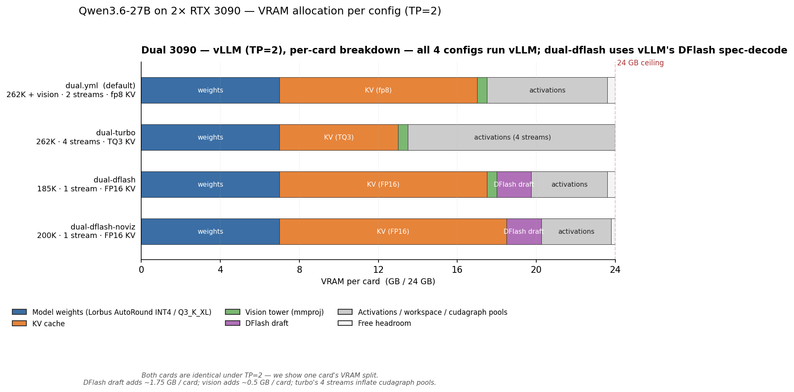

# Dual 3090 — what changes when you add the second card

You have **2× RTX 3090s**. This page gets you to a config and tells you what the second card actually buys. Deep dives are linked at the bottom.

> **Want a model that isn't listed?** → [`PULL.md`](PULL.md): `scripts/pull.sh` evaluates any HF safetensors repo against the KV math without downloading, and boots it if it passes.

> **Have 3+ GPUs?** → [`MULTI_CARD.md`](MULTI_CARD.md) — deriving TP=4 / TP=8 from `dual.yml`, valid TP values, and what scales vs what doesn't.

**NVLink is auto-detected.** The dual composes probe `nvidia-smi topo -m` at boot and configure themselves; you don't pick a compose for it. Override with `NVLINK_MODE=force_on|force_off|pcie_p2p` in `.env`.

---

## Pick a config

Run any of these with `bash scripts/switch.sh <slug>`, or `bash scripts/launch.sh` for the wizard.

### Qwen3.8-27B — the newest model

| Slug | Weights | KV | Max ctx | Narr / Code TPS | Port | State |
|---|---|---|--:|---|--:|---|
| `vllm/qwen38-27b-dual-max` ⭐ | official FP8 | fp8 e4m3 | 262144 | **67.4 / 85.8** | 8091 | 🧪 needs `--force` |
| `vllm/qwen38-27b-dual-fast` | AutoRound INT4 + int8 act | fp8 e4m3 | 262144 | — | 8095 | 🧪 needs `--force` |
| `vllm/qwen38-27b-dual-nvfp4` | NVFP4 | fp8 e4m3 | 262144 | — | 8100 | 🧪 needs `--force` |
| `llamacpp/qwen38-27b-dual-q8kxl` | unsloth Q8_K_XL | q8_0 | 262144 | — | 8087 | 🐣 `--force`, `--list --all` |

`dual-max` numbers measured 2026-08-17 on stock `vllm/vllm-openai:v0.27.1`, 3 warm + 5 measured: TTFT 152 ms, prefill 1166 @10K / 942 @90K tok/s, KV pool 270,930 tok (1.03× concurrency), MTP acceptance 2.62. verify-full pass. Full row: [`BENCHMARKS.md`](../BENCHMARKS.md).

⚠️ **262144 is allocated, not filled** — no NIAH ladder has run on this model. The qwen3.6 sibling fills to ~240K of its 262K; expect the same or worse.

⚠️ **All qwen3.8 slugs ship the MTP drafter on and are exposed to open [vllm#50021](https://github.com/vllm-project/vllm/pull/50021)** (GDN spec-decode wild write — kills workers under sustained multi-turn traffic). Mitigate with `SPEC=off`.

### Qwen3.6-27B

| Slug | Weights | KV | Max ctx | Narr / Code TPS | Port | State |
|---|---|---|--:|---|--:|---|
| `vllm/dual` ⭐ (≡ `qwen-27b-dual-fast`) | AutoRound INT4 | fp8 e4m3 | 262144 | **72 / 90** | 8010 | ⚠️ caveats |
| `vllm/qwen-27b-dual-max` | FP8 | fp8 e4m3 | 262144 | **69 / 90** | 8013 | ⚠️ caveats |
| `vllm/qwen-27b-dual-nvfp4` | NVFP4 | fp8 e4m3 | 262144 | — | 8077 | ⚠️ caveats |

`vllm/dual` is the blessed default — `bash scripts/switch.sh qwen3.6-27b/default` resolves to it. **Strongly recommended for IDE coding agents** (Cline / OpenCode / Roo / Claude Code / Cursor): its fp8 KV avoids the inductor compile-path leak that hit the TQ3 variants ([#16](https://github.com/noonghunna/club-3090/issues/16)).

⚠️ **Fast and max are a tie on quality, not a ladder.** 8-pack: 109/150 vs 110/150 — inside noise. And cross-session TPS comparison is invalid on this rig: single boots swing ~5 TPS on the code leg, wider than the gap between the tiers. Same-session A/B only.

### Other models

| Model | Slug | Max ctx | Port | Notes |
|---|---|--:|--:|---|
| **Gemma-4-31B** | `vllm/gemma-31b-dual` | 224K | 8032 | QAT-AWQ-int4 + bf16 KV, overlay-free. Dual-only on 24 GB — single-card OOMs regardless of KV format. |
| **Qwen3.6-35B-A3B** ⭐ concurrency | `vllm/qwen-35b-a3b-dual` | 262K | 8051 | ✅ production. **The multi-agent pick** — flat to N=16 streams where the dense 27B knees at N=2. |
| **Tess-4-27B** | `llamacpp/tess-dual-mtp` | 262K | 8020 | ✅ production. |
| **Qwen-AgentWorld-35B-A3B** | `vllm/qwen-agentworld-35b-a3b-dual-awq-int4` | 262K | 8080 | ✅ production. |

Everything launchable: `bash scripts/switch.sh --list` (`--all` includes retired).

---

## Sampling defaults

Every Qwen3.6-27B compose ships `temperature 0.6 · top_p 0.95 · top_k 20 · min_p 0.0` — Qwen's precise-coding profile, and the MTP-accept-sweep winner (tighter distribution → higher draft acceptance). For long agentic *reasoning*, use `TEMP=1.0` (same top_p/top_k/min_p).

⚠️⚠️ **`min_p` stays `0.0` in every mode.** A non-zero floor (e.g. `0.75`) collapses the distribution and **traps reasoning models in repetition loops**. It looks like a reasonable quality knob. It is not.

Best practice: let the agent/harness set temperature per task. A coding agent, a planning loop and a summarizer each want different sampling, and only the caller knows which is running — the compose default is just a coding-biased fallback.

---

## Quick start

```bash
# 1. Setup (downloads weights, ~20 min cold; the Marlin overlay is vendored + auto-mounted)
bash scripts/setup.sh qwen3.6-27b

# 2. Pick + boot via wizard (auto-picks TP=2 for matched 2× 3090)
bash scripts/launch.sh

# 3. Or skip the wizard:
bash scripts/launch.sh --variant vllm/dual                 # general default        :8010
bash scripts/launch.sh --variant vllm/qwen-27b-dual-max    # max accuracy (FP8)     :8013
bash scripts/launch.sh --variant vllm/qwen-35b-a3b-dual    # concurrency / agents   :8051

# 4. Sanity test — port matches the slug you booted
curl -sf http://localhost:8010/v1/chat/completions \
  -H "Content-Type: application/json" \
  -d '{"model":"qwen3.6-27b","messages":[{"role":"user","content":"Capital of France?"}],"max_tokens":200}'

# 5. Switch later without re-running setup
bash scripts/switch.sh vllm/qwen-27b-dual-max   # for example
bash scripts/switch.sh --list                   # everything launchable (--all includes retired)
```

---

## Rule of thumb: prioritize context over concurrency

The dual composes default to **the largest context the KV pool allows**, with `--max-num-seqs` as a modest cap. Why:

- **`--max-num-seqs` is a cap, not a reservation.** Setting it to 4 doesn't reserve 4× the context — it caps how many requests run at once. Short and medium requests still pack into the shared pool and run concurrently.
- **The KV pool is fixed by VRAM, not by `--max-model-len`.** Raising the ceiling does **not** shrink the pool — `gemma-bf16-mtp`'s pool is 196,527 tokens whether `--max-model-len` is 32K or 131K. So a higher ceiling is nearly free: it lets one request go bigger without costing short-request concurrency.
- **Dual cards exist to unlock what single can't.** The realistic workload is one or two long-context agents, not high-QPS multitenancy. For pure concurrency at low ctx, a single-card compose or a replica fits better.

Lower `--max-num-seqs` to 2 or 1 only when you need a *guarantee* — two long-context agents that must never preempt each other, or one long request that must never queue.

> ⚠️ **Vision is the exception.** A large image *at* near-max context can OOM on thin headroom (`gemma-bf16-mtp` leaves only ~1.4 GB/card free at 120K single-stream). For vision-heavy long context, lower `--max-num-seqs` or `--gpu-memory-utilization`. Vision at typical context is unaffected.

---

## VRAM budget on 2× 24 GB (TP=2)



**TP=2 splits weights AND KV symmetrically.** Each card holds ~7 GB of weights (vs ~14 GB single-card) plus half the KV pool. That's the whole reason dual unlocks what single can't:

- 262K + vision + 2 streams fits at ~23.6 GB/card on `vllm/dual` — it would need ~33 GB on one card
- Cliff 2 doesn't apply at TP=2: the DeltaNet GDN forward state splits across cards (237K single-prompt verified)

The VRAM column in the tables above is **per card**. On a 2× 20 GB rig (40 GB combined), `vllm/dual` fits. Full math: [`KV_MATH.md`](KV_MATH.md).

---

## Dual-card pitfalls

### ⚠️ Decode-concurrent ≠ long-prefill-overlap

Aggregate throughput figures are measured with N short-prompt streams decoding together. A **different** regime — a long prefill (big tool result, file read, accumulated context) arriving while another stream is already decoding — can **starve decode to ~0.1–0.9 TPS** until the prefill clears. Chunked prefill co-batches the heavy GDN/Mamba chunk with the decode token into one forward step, and the `align` block **floors the chunk at 1568 tokens**, so it can't be tuned away.

Architectural to the hybrid model — expect it on any dual-card chunked-prefill config. **Read aggregate TPS as throughput, not a latency guarantee under agentic traffic.**

Mitigations: lowering `--max-num-batched-tokens` toward the 1568 floor softens it but doesn't eliminate it. **Proxy-level admission control** — gating large prefills away from live interactive decodes — is the real fix. ⚠️ `--scheduling-policy priority` does *not* help: it orders admission, not intra-step compute. ([#208](https://github.com/noonghunna/club-3090/discussions/208))

### NVLink's gain is workload-shaped

Small on single-stream **decode** (~2–5%), large on **prefill / long context** (~35–49%). Without a bridge, `--disable-custom-all-reduce` and `NCCL_P2P_DISABLE=1` are set automatically. No bridge but want P2P over PCIe? `NVLINK_MODE=pcie_p2p` — see [`PCIE_P2P.md`](PCIE_P2P.md).

### Solo user on dual = small win

Single-stream decode leaves one card mostly idle. The win shows up under concurrency, or when you need the KV pool. **If you're a solo user, single-card is often the better cost choice** — see [`SINGLE_CARD.md`](SINGLE_CARD.md).

### The Marlin overlay is automatic

The pad-sub-tile-n fix for AutoRound W4A16 at TP=2 is vendored in-repo and auto-mounted by the compose. **No vLLM clone, no extra setup.** Rationale: [`INTERNALS.md`](../models/qwen3.6-27b/INTERNALS.md).

---

---

## Keeping up

Slugs, defaults and measured numbers move faster than this page. For the latest:

- 📣 **[Announcements](https://github.com/noonghunna/club-3090/discussions/categories/announcements)** — new models and tiers land here first, with the numbers and the caveats. Recent: [Qwen3.8-27B](https://github.com/noonghunna/club-3090/discussions/993) · [the fast + NVFP4 tier](https://github.com/noonghunna/club-3090/discussions/1024).
- 💬 **[Discord](https://discord.gg/gzdfjhj5yN)** — synchronous Q&A, hardware questions, what people are actually running.
- 📋 **[Discussions](https://github.com/noonghunna/club-3090/discussions)** — cross-rig benchmark drops and "should I tune X" threads, searchable.
- ⚙️ **`bash scripts/switch.sh --list`** — the authoritative slug matrix for *your* machine. Always more current than any hand-written table, including the ones above.

## Deep dives

- **[MULTI_CARD.md](MULTI_CARD.md)** — 3+ GPUs: replicate-vs-TP, valid TP values, deriving your own config.
- **[SINGLE_CARD.md](SINGLE_CARD.md)** — what one card can and can't do.
- **[KV_MATH.md](KV_MATH.md)** — predicting per-card VRAM before you boot.
- **[PCIE_P2P.md](PCIE_P2P.md)** — topology, P2P enablement, reading `nvidia-smi topo -m`.
- **[BENCHMARKS.md](../BENCHMARKS.md)** — every measured row, including retired configs.
- **[FAQ.md](FAQ.md)** — engine choice, why my TPS is low, image/video generation, troubleshooting.
- **[QUANTIZATION.md](QUANTIZATION.md)** — quant field guide, KV-cache quant trade-offs.
- **Model detail** — [Qwen3.6-27B](../models/qwen3.6-27b/) · [INTERNALS.md](../models/qwen3.6-27b/INTERNALS.md) · [Gemma 4 31B](../models/gemma-4-31b/)
