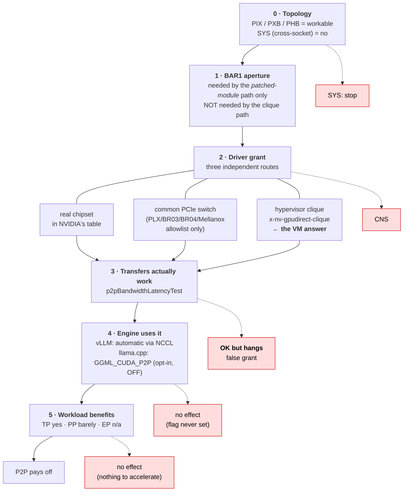
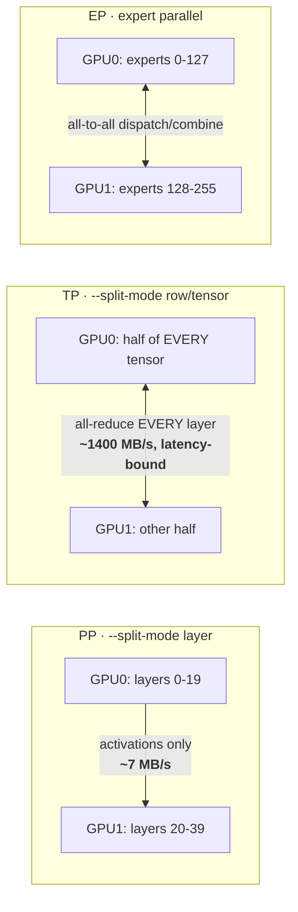

# PCIe Topology & Enabling P2P (multi-GPU, no NVLink)

This is the home for **getting the most out of a PCIe-only multi-GPU rig** — understanding your topology, and (optionally) enabling GPU↔GPU peer-to-peer (P2P) over the PCIe bus when you don't have NVLink.

**You don't need any of this to run the stack.** The default dual/multi-card path is PCIe-only with P2P *off* (`NCCL_P2P_DISABLE=1`, custom all-reduce disabled) — it's robust, needs no tuning, and works out of the box on any consumer rig. This doc is for two audiences: anyone who wants to **read their topology correctly** (why does `topo -m` say `PHB`?), and enthusiasts who want to **squeeze a workload-dependent few-to-~20% more** out of the PCIe bus via P2P. If you have an NVLink bridge, see [HARDWARE.md → NVLink](HARDWARE.md#nvlink) instead — that path auto-detects.

> **Example rig used throughout:** ASRock Rack **ROMED8-2T** (single-socket EPYC SP3) + 2× RTX 3090. It's just a concrete illustration (one maintainer's box) — the principles are board-agnostic; substitute your own slot/BIOS specifics.

---

> **Two models, one subject — how they fit.** §0 below is the **setup** model: six gates from hardware
> to workload, each with a distinct failure. The **three layers** here are a **diagnostic** zoom-in on
> gates 2 and 4 — use them when P2P is already configured and you're asking "is it actually on right
> now?". Setting up? Start at §0. Triaging a live rig? Start here.

## The three layers of "is P2P on?" — read this first

"P2P" is three independent questions stacked on top of each other, and every confused triage in our tracker came from conflating them ([disc #773](https://github.com/noonghunna/club-3090/discussions/773) has the worked example):

| Layer | Question | How to check |
|---|---|---|
| **1. Driver** | Is direct GPU↔GPU access *granted*? | `nvidia-smi topo -p2p rw` (= OK), module flavor (§5); strongest: a transfer-verified cache (§7) |
| **2. NCCL** | Is the granted path *used* for transfers? | `NCCL_P2P_LEVEL` set + layer 1 granted — this is where most of the P2P benefit flows, at any GPU count |
| **3. vLLM's custom all-reduce** | Is vLLM's *extra* kernel on top of NCCL active? | vLLM's own log: the `Custom allreduce is disabled…` line means no. At >2 GPUs it requires a **full NVLink mesh** and never consults P2P ([#786](https://github.com/noonghunna/club-3090/issues/786)) — so on 3+-card PCIe rigs layer 3 is always off, *by design, not misconfiguration*, and P2P still pays through layer 2 |

### Why layer 3's gate asks about NVLink and not peer access (2026-07-30)

Read from `vllm/distributed/device_communicators/custom_all_reduce.py` (verified identical in v0.24.0 and v0.25.1). **The NVLink test was never intended as the requirement — it is a cheap pre-filter in front of an expensive one**, and its own comments say so:

```python
# test nvlink first, this will filter out most of the cases
# where custom allreduce is not supported
fully_connected = current_platform.is_fully_connected(physical_device_ids)
if world_size > 2 and not fully_connected:
    logger.warning("Custom allreduce is disabled because it's not supported on"
                   " more than two PCIe-only GPUs. ...")
    return                      # <-- disqualifies, instead of falling through
# test P2P capability, this checks software/cudaruntime support
# this is expensive to compute at the first time
# then we cache the result
if not current_platform.is_rocm() and not _can_p2p(rank, world_size):
```

`gpu_p2p_access_check()` spawns subprocesses to test real transfers — slow on first call, hence cached. `is_fully_connected` exists to avoid paying that when it would fail anyway. The narrow defect: at `world_size > 2` the pre-filter `return`s rather than deferring to the P2P check a patched PCIe rig would pass. An early-out optimisation became a hard gate.

Two details confirming it is a heuristic and not a kernel limit:

- The condition is literally `world_size > 2`. **At TP=2 the NVLink test is skipped entirely**, which is exactly why dual-card PCIe rigs get layer 3 and 4-card rigs do not — the peer-access result is never consulted at world>2.
- `_SUPPORTED_WORLD_SIZES = [2, 4, 6, 8]` — the kernel itself supports 4 cards. Patching `is_fully_connected` works rather than crashing.

**Why `>2` plausibly exists** (inference from the algorithm shape, *not* stated upstream): custom AR has every rank write into every peer's buffer. At 2 GPUs that is one peer over one link; at 4 on a shared PCIe fabric the N−1 peer writes per rank contend for the same host-bridge bandwidth, while NVLink is point-to-point per pair and NCCL's ring/tree is topology-aware. It reads as an NVSwitch-era assumption never retested against P2P-patched consumer hardware.

**The 8 MiB cap is why forcing the gate is a tradeoff, not a free win.** `CustomAllreduce(max_size=8192 * 1024)` — tensors above 8 MiB fall back to NCCL regardless. So decode-sized tensors take the custom path and win, while prefill-sized ones exceed the cap, go through NCCL anyway, and still pay the registration overhead.

**We measured the bypass and deliberately do not ship it.** Forcing `is_fully_connected → True` at TP=4 on a patched 4×3090 gives **≈ +15% decode**, independently reproduced by [@superalesha](https://github.com/noonghunna/club-3090/discussions/773#discussioncomment-17834828) at **+14.8%** (80.9 → 92.9 tok/s single-stream, 144 → 165 at 16 users) — **with prefill paying for it** (TTFT +9% at c16, consistent with the cap above). Note the flag is read twice, once to build the communicator and once in `should_custom_ar`, so a half-patch does nothing. club-3090 keeps the gate: the tradeoff is workload-dependent, and monkeypatching an engine's topology gate is not something we want in a default path on other people's rigs. The clean upstream fix is to let `world_size > 2` fall through to `_can_p2p` and gate on measured benefit instead of link type.

**Where NVLink fits:** a bridge is the native version of layer 1 (no patched driver needed) and a faster layer 2 for the bridged pair. Layer 3 follows the same mesh rule: **2× 3090 + bridge → all three layers on**; **4× 3090 with two pairwise bridges → layer 3 still off** (consumer cards bridge exactly two GPUs; full meshes are NVSwitch/SXM territory). `report.sh`'s *Interconnect verdict* (§7) resolves all three layers for you.

---

## 0. The layer stack — what has to be true for P2P to actually help

Six gates. **Every one must pass**, and each fails with a different symptom. Most confusion comes from
fixing one gate and expecting the whole stack to work.



| gate | fails as | where |
|---|---|---|
| 0 Topology | cross-socket is unfixable | §1, §2 |
| 1 BAR1 | patched path unreachable | §4, §4a |
| 2 Driver grant | **`CNS`** | §4a |
| 3 Transfers | `OK` that **hangs** | §4a, §7 |
| 4 Engine | silently no effect | §6, §7a |
| 5 Workload | honest zero | §6 |

---

## 0a. TP vs PP vs EP — why the parallelism mode decides whether P2P matters



| mode | inter-GPU traffic | does P2P help? | availability |
|---|---|---|---|
| **PP** (`layer`) | activations at the boundary — **~7 MB/s measured** | **Barely.** Nothing to accelerate | ✅ everywhere; the safe default |
| **TP** (`row`/`tensor`) | all-reduce every layer — **~1400 MB/s**, many small serialized transfers | **Yes — and via LATENCY, not bandwidth.** 15.23 → 1.01 µs is the real win | ⚠️ `row` needs split-buffer support; `tensor` is upstream-EXPERIMENTAL and hits [#24489](https://github.com/ggml-org/llama.cpp/issues/24489) below NCCL 2.27.5 |
| **EP** | all-to-all token routing | Yes in principle | ⛔ **not expressible in llama.cpp** — all experts of a layer live in one packed tensor, so `-ot` granularity is the whole per-layer bundle |

> ⚠️ **PP is not parallelism at `-np 1`.** With a single sequence the GPUs run in *sequence* — GPU0 does
> its layers while GPU1 idles, then swaps. Measured: 1 GPU **128.72** → 2 GPU `layer` **144.29** TPS,
> just **+12%**. The second card is buying **capacity, not speed**. Expect real pipelining only with
> multiple in-flight sequences.
>
> ⚠️ **Reason about latency, not bandwidth.** Link utilisation is often under 20% while the latency
> saving is 15×. Concluding "P2P can't matter, we're not bandwidth-bound" is the single most common
> analysis error here — we made it ourselves.

---

## 0b. Which path are you on? Bare metal vs virtualised

**Check first — it changes every step that follows:**

```bash
systemd-detect-virt          # qemu/kvm = virtualised · none = bare metal
```

| step | 🖥️ **Bare metal** | 🧊 **VM (VFIO passthrough)** |
|---|---|---|
| **Read BAR1 / ReBAR** | `lspci -vv` in place | ⚠️ **on the HOST** — a guest exposes *no* ReBAR capability and reports 256M for a card that supports 32G |
| **Enable large BAR1** | BIOS: Above 4G + Re-Size BAR | Host BIOS (same), then confirm the guest sees it |
| **Get the driver grant** | open modules, or the §5 patched module | ⚠️ **`x-nv-gpudirect-clique`** (§4a). The chipset table can never match an emulated bridge |
| **Verify** | transfer test (§7) | transfer test **and a real collective** — copies can pass while collectives hang |
| **Enable in the engine** | §0c | §0c (identical) |

### Pitfalls of each — the ones that actually cost us time

**🖥️ Bare metal**

| pitfall | why it bites |
|---|---|
| VBIOS caps BAR1 at 256MB | A genuine firmware gate. No BIOS setting or driver helps; needs a vendor ReBAR VBIOS (#734). Check `lspci` `supported:` — but only on bare metal |
| Closed driver refuses P2P on GeForce | `modinfo -F license nvidia` = `NVIDIA` → refuses. Open modules (`Dual MIT/GPL`) may grant; the §5 patched module usually does |
| **ACS silently kills it** | ACS-redirect forces peer traffic through the root complex. The #1 silent killer — costs bandwidth, not correctness |
| Cross-socket (`SYS`) | Unfixable. Move a card |
| `topo -m` looks fine but one GPU is slow | It shows link *type*, not *quality* — a chipset-attached card can run at half the bandwidth of a CPU-attached pair (§1) |

**🧊 Virtualised**

| pitfall | why it bites |
|---|---|
| **Guest BAR1 reading is a lie** | No ReBAR capability is exposed. We diagnosed our own cards as VBIOS-capped when they support 32G |
| **`CNS` is a chipset-table verdict** | Not fixable by BAR size, driver flavour, IOMMU or ACS. We proved all four (§4a) |
| `NVreg_RegistryDwords` don't help | Measured, refuted. They relax peer *mapping*, not the chipset check |
| **A patched module doesn't help either** | The p2p forks never touch `chipset_pcie.c`. The gate fires upstream of everything they change |
| Emulated PCIe switch doesn't help | `clFindCommonDownstreamBR()` uses an allowlist; QEMU's TI XIO3130 isn't on it |
| `hidden=1` silently defeats the clique | It emits `kvm=off`, and the clique path is gated on `bDetected` |
| Dotted QEMU ids silently defeat it | A bare BDF yields `hostpci0.0`; `-set` can't target dotted ids. Use explicit `.0` |
| **⛔ The clique can grant copies but hang collectives** | On this rig: 27 GB/s verified, then llama.cpp `tensor` and vLLM TP=2 both hung. **Test a real collective** (§4a) |
| **Lockout risk** | A bad `args` line stops the VM booting. If your only shell is *inside* that guest, back the config up first |

---

## 0c. Turning P2P ON in your engine (gate 4) — it is not automatic

A driver grant does **not** mean your engine uses it. Each engine has its own switch and its own default:

| engine | default | turn ON | turn OFF (escape hatch) |
|---|---|---|---|
| **vLLM** | **auto-enabled** by our composes' entrypoint on a grant | `NVLINK_MODE=pcie_p2p` to force | `NVLINK_MODE=force_off`, or `NCCL_P2P_DISABLE=1` on a raw `docker run` |
| **llama.cpp** | ⚠️ **OFF** — opt-in regardless of the grant | `GGML_CUDA_P2P=1` **and** `--split-mode row`/`tensor` | unset `GGML_CUDA_P2P` |
| **SGLang** | no interconnect detection | `NCCL_P2P_DISABLE=0` | `NCCL_P2P_DISABLE=1` |

⚠️ **The three most common mistakes here:**

1. **`NVLINK_MODE` on llama.cpp does nothing** — it is a vLLM-compose variable. Toggling it proves nothing.
2. **`NCCL_P2P_DISABLE` on llama.cpp `--split-mode layer` does nothing** — that path uses no NCCL. It *does* apply to `row`/`tensor`, which do NCCL all-reduce.
3. **Enabling it on `--split-mode layer` changes nothing measurable** — that mode moves ~7 MB/s between GPUs. There is nothing to accelerate (§0a).

**Confirm it actually engaged** — don't infer from TPS:

```bash
# vLLM: the boot log states it plainly
docker logs <container> 2>&1 | grep -iE "custom allreduce|nccl"

# llama.cpp: peer access is only attempted when the env var is set
docker inspect <container> --format '{{range .Config.Env}}{{println .}}{{end}}' | grep GGML_CUDA_P2P
```

---

## 1. Reading your topology: why `PHB`, not `PIX`

`nvidia-smi topo -m` labels each GPU↔GPU link by the *closest common point* the two cards share:

| Code | Meaning | Relative speed |
|---|---|---|
| `NV#` | NVLink (# = number of links) | fastest |
| `PIX` | a single PCIe **switch** (one bridge hop) | fast |
| `PXB` | multiple PCIe switches | good |
| `PHB` | a PCIe **Host Bridge** (the CPU root complex) | PCIe-bound |
| `NODE` | across host bridges within one NUMA node | slower |
| `SYS` | across NUMA nodes / sockets | slowest |

`PIX` requires a physical **PCIe switch chip** (PLX/PEX) sitting between the two slots. Most server/workstation boards — the ROMED8-2T included — have **no PLX switch**: every slot routes straight to the CPU's IO die. So two GPUs in different slots meet at the **CPU host bridge**, and **`PHB` is the correct, expected result** — not a misconfiguration, and not something a "better slot" will turn into `PIX`. (You only see `PIX` on boards with an onboard PCIe switch, or via a PLX riser.)

`PHB` is **not** a dead end for P2P. It just means peer traffic crosses the CPU root complex rather than a dedicated switch. Whether P2P actually *engages* over `PHB` depends on three more things: NUMA placement (§2), BIOS/ACS (§4), and the driver (§5).

---

> ### ⚠️ `topo -m` tells you link *type*, not link *quality*
>
> Two pairs can both report `PHB` and differ **2× in real bandwidth**. Worked example from a community
> 3× 3090 rig (2026-08-05): all three pairs showed `PHB`, yet
>
> | pair | attachment | P2P bandwidth |
> |---|---|---|
> | GPU1 ↔ GPU2 | direct CPU lanes, true x8 | **13.17 GB/s** |
> | GPU0 ↔ GPU1/2 | **via the chipset**, x4 effective | **~6.5 GB/s** |
>
> All three negotiated "PCIe 4.0 x8" and `topo -m` gave no hint that one card sits behind the chipset.
> Only `p2pBandwidthLatencyTest` exposed it. **Run the bandwidth test on any new multi-GPU layout
> before trusting the topology matrix** — and when picking which cards to pair, prefer the ones on
> direct CPU lanes. A chipset-attached GPU drags every collective down to its own link.

## 2. NUMA: keep both cards in one domain

EPYC (and multi-socket Xeon) can expose the socket as 1 or 4 NUMA nodes — `NPS1` / `NPS4` in BIOS. Under `NPS4`, two GPUs in different CPU quadrants can report `NODE` (or worse) instead of `PHB`, adding cross-die latency to every all-reduce.

**Set `NPS1`** (one NUMA node per socket) so both GPUs share a domain and report `PHB` — the cleanest single-socket layout for TP=2. On a true multi-socket box, keep both GPUs on the **same socket** (otherwise you get `SYS`, the worst case).

---

## 3. Physical slot choice (two triple-slot GPUs)

A 3-slot (triple-width) card like most 3090s covers its own slot **plus the two below it**, so you need slots spaced **≥3 positions apart**.

- Use the **first usable x16 slot + one three positions down** so the coolers don't collide and both cards train the full x16 width. On the ROMED8-2T (7× PCIe 4.0 x16 slots) that's typically the top slot paired with one ~3 slots lower — **check your board's manual block diagram for the exact pair**, since the spacing and which slots are full-x16 vary.
- **Mind lane-sharing with onboard M.2 / NVMe.** Many boards bifurcate or share lanes between a PCIe slot and an onboard M.2 (often jumper- or BIOS-gated). A populated M.2 can silently drop your second GPU slot to **x8**, or disable it. Consult the manual's lane-allocation / jumper table before committing a pair.
- **Always verify the *trained* width** after seating — a slot can negotiate lower than its physical size:
  ```bash
  nvidia-smi --query-gpu=index,pcie.link.width.current,pcie.link.gen.current --format=csv
  # or:  sudo lspci -vv | grep -E 'LnkCap|LnkSta'
  ```
  `report.sh` captures this automatically (it flags a slot that trained narrower than the GPU's capability).

---

### 3a. Which slots — CPU lanes vs chipset lanes

**Not all x16 slots are equal.** Slots hang off either the CPU's own lanes or the chipset/PCH, and the
difference is invisible in `nvidia-smi topo -m` — both report `PHB`.

Measured on a community 3× 3090 rig (2026-08-05), all three pairs reporting `PHB`:

| pair | attachment | P2P bandwidth |
|---|---|---|
| GPU1 ↔ GPU2 | **direct CPU lanes**, true x8 | **13.17 GB/s** |
| GPU0 ↔ GPU1/2 | **via the chipset**, x4 effective | **~6.5 GB/s** |

All three negotiated "PCIe 4.0 x8" on paper. **Put your GPUs on CPU lanes.** A chipset-attached card
drags every collective down to its own link, because all-reduce runs at the slowest participant. If you
have three cards and only two CPU-attached slots, pair the two good ones and give the chipset slot the
least interconnect-sensitive job.

Find out which is which from the board manual, or infer it from the PCIe tree — chipset-attached
devices sit behind an extra bridge:

```bash
lspci -tv | head -30      # devices under the chipset appear beneath its bridge
lspci -vv -s <bdf> | grep -E 'LnkCap|LnkSta'
```

### 3b. Boards with a REAL PCIe switch (PLX) — a shortcut past the chipset gate

If both GPUs sit under a genuine **PLX/Broadcom 87xx or 97xx** switch (common on HEDT/server boards and
some 4-way GPU carriers), `clFindCommonDownstreamBR()` finds a common downstream bridge and the driver
**skips the chipset table entirely** — the `CNS` failure in §4a cannot occur.

The allowlist is specific: **NVIDIA BR03/BR04, PLX `0x10B5` 87xx/97xx, PMC, Mellanox**. A switch outside
it does not count — which is exactly why QEMU's emulated TI XIO3130 fails (§4a).

```bash
lspci -nn | grep -iE '10b5|bridge'    # look for a 10b5:87xx / 10b5:97xx upstream port
```

Worth knowing when buying: a board with a real PLX switch sidesteps the entire chipset-compatibility
question. The trade is that a switch shares its upstream bandwidth across everything behind it.

### 3c. Risers — the quiet source of half-speed links

Risers are common in multi-GPU builds (clearance, orientation, mining frames) and are a frequent cause
of links that train below their physical width.

| risk | detail |
|---|---|
| **Mining risers are useless here** | USB-cable "x16-to-x1" risers give **x1** — 1/16 of the bandwidth. Fine for mining, unusable for P2P or tensor-parallel |
| **Gen4 needs a gen4-rated riser** | Gen4 doubles signalling rate and is far less tolerant of cheap cable/PCB. A gen3-era riser typically trains **down to gen3 or gen1**, or errors under load |
| **Length and redrivers** | Longer runs need a redriver/retimer. Passive risers past ~15 cm at gen4 are marginal |
| **Failures are silent** | You get a working GPU at reduced bandwidth, or intermittent instability — not an error message |

**Verify under load, not at idle** — links downtrain when idle, so an idle reading looks worse than reality:

```bash
# while a job is running:
nvidia-smi --query-gpu=index,pcie.link.gen.current,pcie.link.width.current --format=csv
```

Compare against `pcie.link.gen.max` / `pcie.link.width.max`. Trained below capability on a slot you
believe is x16 → suspect the riser first, then BIOS bifurcation, then the slot itself.

**Check for link errors**, which a bad riser produces and nothing else surfaces:

```bash
sudo lspci -vv -s <bdf> | grep -A2 -E 'Correctable|UncorrectableErr|AER'
sudo dmesg -T | grep -iE 'AER|pcieport.*error'
```

Rising correctable-error counts under load are the signature of a marginal riser. A clean link reports
none. ⚠️ `report.sh` flags a slot that trained narrower than the GPU's capability, but it cannot tell you
*why* — riser, bifurcation and slot all look identical from the trained width alone.

---

## 4. BIOS settings that matter

| Setting | Set to | Why |
|---|---|---|
| **Above 4G Decoding** | **Enabled** | Required to map large GPU BARs above the 4 GB boundary; prerequisite for ReBAR and for P2P BAR access. |
| **Re-Size BAR / Smart Access Memory** | **Enabled** | Lets the CPU address the full VRAM aperture; helps both model load and P2P. |
| **IOMMU** | **Passthrough** (`iommu=pt`) for bare-metal P2P; **enforcing** only for VFIO/VM passthrough | An *enforcing* IOMMU + ACS routes peer traffic up to the root and back, defeating direct P2P. What matters is that the IOMMU isn't *translating* for these devices, which `iommu=pt` gives you while leaving it up. ⚠️ **The patched-module path documents `pt` specifically, not "off"** — aikitoria's setup step 1 is `amd_iommu=on iommu=pt` (Intel: `intel_iommu=on iommu=pt`) in `/etc/default/grub`. Switching the IOMMU off in BIOS also stops translation, but it is off their documented path; if you're on the patched module and P2P misbehaves, match their setup before debugging anything else ([#873](https://github.com/noonghunna/club-3090/issues/873)). |
| **ACS (Access Control Services)** | **Disabled** for bare-metal P2P | ACS-redirect on the upstream port forces P2P transactions through the root complex — the **#1 silent P2P killer**. Leave **On** only if you need VM isolation (a genuine tradeoff). |
| **NPS** (EPYC) | **NPS1** | Keeps both GPUs in one NUMA domain (§2). |

> **⚠️ Ampere consumer cards: the ReBAR toggle is gated by GPU firmware, not the motherboard** (#734, @alexpolo1). On RTX 3090-class cards the BAR1 size ceiling comes from the **VBIOS** — with a launch-era (pre-ReBAR) VBIOS the BIOS toggle silently does nothing. Check before assuming:
>
> ```
> sudo lspci -vv -s <bus> | grep -A4 "Physical Resizable BAR"
> ```
>
> If `BAR 1: supported:` tops out at 256MB, the card *may* need a ReBAR VBIOS from its **board vendor** — but **read §4a first if there is any chance you are inside a VM**, because a guest can report exactly this while the physical card supports 32GB.
>
> ⚠️ **CORRECTED 2026-08-05.** This note previously cited the reference rig's two 3090s as ReBAR-era VBIOS (`94.02.42.*`) that "still advertise `supported: 256MB` only", and concluded the VBIOS was the cap. **That was wrong, and it was wrong in an instructive way.** That reading was taken *inside a QEMU guest*, which exposes **no Resizable BAR capability at all**. Read on the *host*, the same two cards report `supported: 64MB 128MB 256MB 512MB 1GB 2GB 4GB 8GB 16GB 32GB`. Nothing was VBIOS-capped; the capability was simply invisible from where we looked. A `supported:` list is only evidence about the *hardware* when you read it on bare metal.

---

## 4a. Virtualised rigs (VFIO passthrough): diagnose on the HOST, not the guest

If your GPUs are passed through to a VM, **every BAR/ReBAR reading taken inside the guest is untrustworthy** and the fix lives on the host. Confirm where you are before believing anything else:

```
systemd-detect-virt                 # qemu / kvm / none
cat /sys/class/dmi/id/product_name  # "Standard PC (Q35 + ICH9, ...)" = emulated
```

**Worked example (reference rig, 2026-08-05).** Guest showed BAR1 `256M`, no Resizable BAR capability, `topo -p2p r` = `CNS`. The host told a completely different story — and the actual gate was a single BIOS toggle:

| where | before | after enabling **Re-Size BAR Support** in host BIOS |
|---|---|---|
| host `lspci` BAR1 | 256M | **32G** |
| host bridge prefetchable window | **288M** (= 256M BAR1 + 32M BAR3, i.e. sized exactly to the current BARs — the tell) | **32800M** |
| guest `nvidia-smi -q -d MEMORY` BAR1 | 256 MiB | **32768 MiB** |

**The bridge window is the real diagnostic, not the BAR.** A window sized to exactly `BAR1 + BAR3` means firmware allocated no room to grow, which is what ReBAR-disabled looks like. The `resource1_resize` sysfs knob will exist and still fail, because there is nowhere to expand into.

Note also that **Above 4G Decoding being on is not the same as ReBAR being on** — the reference rig had 64-bit prefetchable regions at ~4.9 TB (so Above 4G was clearly working) while BAR1 stayed at 256M.

> ### ⛔ A large BAR1 is necessary but NOT sufficient in a VM
>
> With BAR1 at 32 GB in the guest **and** the open kernel modules loaded (`modinfo -F license nvidia` → `Dual MIT/GPL`, driver 610.57.04), `topo -p2p r` **still reported `CNS`**.
>
> `CNS` is *Chipset Not Supported* — the driver consulting its **supported-chipset table**. A QEMU guest presents an emulated **Q35/ICH9**, which will never appear on that list at any aperture size. **The aperture was never the gate at that layer.**
>
> Two things follow, both measured on this rig rather than inferred:
> - **Stock `nvidia-open` alone does not grant P2P on consumer 3090s under virtualisation.** (It has been reported working on bare-metal server boards — see #688 — so this is a statement about VMs, not about the open modules.)
> - Defeating a chipset-table verdict is exactly what the §5 patched module removes from the source. Registry keys like `PeerMappingOverride` relax peer *mapping* restrictions; they do not reach the chipset check.
>
>   **Measured, not assumed (2026-08-05):** with `options nvidia NVreg_RegistryDwords="RMForceStaticBar1=1;PeerMappingOverride=1"` **confirmed live** after a reboot, `topo -p2p r` still reported `CNS`. The cheap registry path is therefore **ruled out** on a virtualised rig — go straight to §5 if you intend to pursue this.
>
>   ⚠️ **Verify the override the right way, or you'll misread the result.** `/sys/module/nvidia/parameters/NVreg_RegistryDwords` reads **empty even when the setting is active** (it's a `charp` the module copies without retaining). The authoritative source is:
>
>   ```
>   grep -i registrydwords /proc/driver/nvidia/params
>   ```
>
>   Trusting the sysfs node would make you conclude the override never applied and retry it forever.
>
> ⚠️ **And even a patched module may not be enough under VFIO.** Peer DMA between two passed-through devices must be routed by the host IOMMU, and ACS on the root ports — the very thing giving you clean per-GPU IOMMU groups — pushes peer traffic upstream. **Do not reflexively disable ACS to chase this**: on the reference rig each GPU sits alone with its audio function in its own IOMMU group, and merging those groups can break passthrough outright. That is trading "no P2P" for "no GPUs". Treat ACS as a deliberate, reversible experiment, never a default.

### Why a VM reports `CNS` — the exact gate, read from the driver source

Two functions decide this, both in `src/nvidia/src/kernel/platform/`:

**1. `p2p_caps.c` — the gate itself:**

```c
// If the chipset is not capable AND there is no common PCIe switch,
// then P2P is not supported.
if ((!pCl->bPciePeerReadCapable || !pCl->bPciePeerWriteCapable) &&
    (!bCommonPciSwitchFound))
{
    *pP2PReadCapStatus  = NV0000_P2P_CAPS_STATUS_CHIPSET_NOT_SUPPORTED;
    *pP2PWriteCapStatus = NV0000_P2P_CAPS_STATUS_CHIPSET_NOT_SUPPORTED;
}
```

**2. `chipset_pcie.c` — where the capability flags come from.** The driver walks a
`pciePeerAccessCaps[]` table, matching the **Front Host Bridge** (`00:00.0`) on vendor /
device / subsystem IDs. The table **ends in a default-deny**:

```c
// Last entry - default = not supported
{CHIPSET_ANY, CHIPSET_ANY, CHIPSET_ANY, CHIPSET_ANY, CHIPSET_ANY, CAPABLE_NONE},
```

A QEMU guest presents an emulated **Intel 82G33 [`8086:29c0`]** front host bridge, which appears
nowhere in that table. It falls through to the deny-all, both flags go `NV_FALSE`, and the gate
fires. **On bare metal the same rig's real bridge (e.g. AMD `[1022:1480]`) matches an allow entry
and the gate never fires** — which is the entire difference between host and guest.

> ⚠️ **The patched-module forks do NOT change this.** We read the `610.43.02-p2p` tree: it modifies
> BAR1 P2P *transport* across 17 files, and touches `chipset_pcie.c` **not at all**. On bare metal
> the gate never fires so this is invisible; in a VM the gate fires first and nothing downstream
> matters. **Installing a patched module in a VM will not clear `CNS`.** Confirm before you build.

### ⚠️ THE GRANT-CLEARER — `x-nv-gpudirect-clique` (config-only; clears `CNS`, does NOT prove delivery)

**This clears the `CNS` refusal.** It is NVIDIA's own sanctioned mechanism and needs no patched driver.
⚠️ **Corrected 2026-08-10** — this section previously said "transfer-verified": on the reference rig the
mapping the clique grants was later proven to be a **mirror** (writes reflect back to the writer; the
peer never receives a byte — see the verdict block below), and the "passing transfer test" was a
round-trip/bandwidth false positive. The mechanism below is still the only config-only way past the
chipset gate, and field reports suggest it delivers on some hosts — but treat the grant as unproven
until a **destination-verified** transfer or a value-checked collective passes.

`hypervisorPcieP2pDetection()` is consulted **125 lines before** the chipset denial and short-circuits
straight out of it (`p2p_caps.c:438`):

```c
// Check for hypervisor oriented PCIe P2P overrides
if (pHypervisor && pHypervisor->bDetected &&
    hypervisorPcieP2pDetection(pHypervisor, gpuMask))
{
    *pP2PReadCapStatus  = NV0000_P2P_CAPS_STATUS_OK;
    *pP2PWriteCapStatus = NV0000_P2P_CAPS_STATUS_OK;
    goto done;                       // chipset table never reached
}
```

The driver reads a **Virtual P2P Approval** capability from the GPU's PCI config space, which the
hypervisor injects. NVIDIA's own comment states the intent:

> *"We provide a way for any hypervisor … to indicate peer-to-peer capability among GPUs by specifying
> a peer 'clique' ID … By specifying a peer clique ID, the hypervisor **warrants** that PCI-E P2P has
> been tested and works correctly between all GPUs with the same clique ID."*

QEMU implements it as `x-nv-gpudirect-clique`. **GPUs sharing a clique ID are granted P2P.**

#### Proxmox recipe

```ini
cpu: host,flags=+pcid                    # ⚠️ hidden=1 REMOVED — see below
hostpci0: 0000:81:00.0,pcie=1            # ⚠️ explicit .0 — see below
hostpci1: 0000:c1:00.0,pcie=1
args: -set device.hostpci0.x-nv-gpudirect-clique=1 -set device.hostpci1.x-nv-gpudirect-clique=1
```

Two details are load-bearing; get either wrong and it silently does nothing:

| detail | why |
|---|---|
| **Remove `hidden=1`** | It emits `-cpu host,kvm=off`, hiding the CPUID hypervisor signature. The clique path is gated on `pHypervisor->bDetected` — hide KVM and the override is never consulted. |
| **Specify function `.0`** | Bare `0000:81:00` passes *all* functions and yields QEMU IDs containing dots (`hostpci0.0`, `hostpci0.1`). QEMU's `-set` parser cannot target dotted IDs, so the property lands nowhere. Explicit `.0` gives `hostpci0`. (Side effect: the HDMI audio function is no longer passed. Irrelevant for inference; re-add as separate `hostpciN` entries **without** the clique property if needed.) |

`qm set` on a running VM stages into `[PENDING]` and applies at next boot. **Back up first** —
`cp /etc/pve/qemu-server/<vmid>.conf /root/<vmid>.conf.bak` — because a bad `args` line can stop the VM
booting, and if your only shell is *inside* that guest you will have locked yourself out.

Verify the generated command line **after** boot (`qm showcmd` reads the *active* config, not `[PENDING]`):

```bash
ps -o args= -p "$(qm status <vmid> --verbose | awk '/^pid:/{print $2}')" \
  | tr ' ' '\n' | grep -E 'kvm=off|gpudirect-clique'
```

Want: two `gpudirect-clique=1`, and **no** `kvm=off`.

#### Measured result (2× RTX 3090, PCIe gen4 x16, Proxmox q35 guest)

| metric | P2P off | P2P on | gain |
|---|---|---|---|
| Unidirectional | 11.28 GB/s | **27.12 GB/s** | 2.4× |
| Bidirectional | 16.77 GB/s | **54.21 GB/s** | 3.2× |
| **Latency** | 15.23 µs | **1.01 µs** | **15×** |

27 GB/s is gen4 x16 line rate — the full physical link, not a partial path. No Xids, no AMD-Vi/IOMMU
faults. `topo -p2p` went `CNS` → `OK` in both directions.

⚠️ **The latency number is the important one.** Tensor-parallel all-reduce is a stream of many small
serialized transfers — latency-bound, not bandwidth-bound. Reasoning only about GB/s will lead you to
conclude P2P "can't matter here" when the 15× latency drop is the whole story. We made exactly that
mistake.

> ⚠️ **The clique flag ASSERTS capability; it does not create it.** NVIDIA's wording is that the
> hypervisor *warrants* P2P works. If it doesn't, you have manufactured a false grant — worse than an
> honest refusal, because composes auto-enable on the grant and NCCL then **hangs silently** rather
> than falling back ([#873](https://github.com/noonghunna/club-3090/issues/873)). Keep
> `NVLINK_MODE=force_off` staged as the escape hatch.

> ### ⛔⛔ VERDICT ON THIS RIG: the clique grant BROKE both engines' collective paths

**Read this before following the recipe above.** On the reference rig the clique produced a working
*benchmark* and a broken *stack*:

| workload | result with the clique active |
|---|---|
| `p2pBandwidthLatencyTest` | ✅ 11.28 → **27.12 GB/s**, 15.23 → **1.01 µs** |
| llama.cpp `--split-mode layer` | ✅ unaffected, boots 12 s |
| llama.cpp `--split-mode tensor` | ❌ **hangs in warmup** |
| **vLLM TP=2** | ❌ **hangs at `ncclCommInitRank`** — 492 MiB, weights never load, both GPUs spinning |

The vLLM hang is [#873](https://github.com/noonghunna/club-3090/issues/873)'s exact signature: boot
stops dead after `vLLM is using nccl==…`, no error.

✅ **CORRECTED: these are ONE bug, not two.** We first blamed llama.cpp's half on
[#24489](https://github.com/ggml-org/llama.cpp/issues/24489) and an NCCL version boundary. Wrong on
both counts — #24489's real fix is [PR #24491](https://github.com/ggml-org/llama.cpp/pull/24491)
(`cuMemSetAccess` on llama.cpp's own VMM pool), and `b10236` **already contains it**. Both engines fail
for the **same** reason: **NCCL collectives over a clique-granted peer path**. Isolated to a standalone
`nccl-tests` reproducer with no engine involved — `ncclCommInitRank` completes in ~0.22 s, then the
**first collective** never returns.

~~**Point-to-point copies work. Real collectives do not.**~~ ⚠️ **Corrected 2026-08-10 — the copies
never worked either.** A boundary probe on a clique-restored boot proved the granted aperture is a
**mirror**: every peer path (CE copy, SM store, SM load, system-scope atomics) misroutes to a private
per-direction backing. The writer reading back through the peer window sees its own full pattern; the
target GPU reading the same buffer locally sees untouched zeros; both directions; zero host IOMMU
faults. The bandwidth table above is real — but it measured **posted-write completion into the wrong
page**, not delivery. And a round-trip verification (copy A→B, copy back, compare) is an *identity
operation* under a mirror, structurally unable to detect it: only a **one-way transfer verified at the
destination** exposes the class. The NCCL hangs and the CE-path corruption are both downstream of this
single silent misroute. Minimal repro + full matrix: the [NVIDIA/nccl#2335 row in
UPSTREAM.md](UPSTREAM.md). NVIDIA's wording covers exactly this: the hypervisor *warrants* P2P works,
and a warrant is not a measurement.

**So on a VM, treat the clique as UNPROVEN until your own collective workload boots.** If it hangs:
- Immediate, no reboot: `NCCL_P2P_DISABLE=1` (verified — vLLM TP=2 then loaded 9.66 GiB in 41 s and
  served normally), or `NVLINK_MODE=force_off` on our composes.
- Proper: drop the `args` line from the VM config and restart.

The recipe above is still the only mechanism that clears `CNS` config-only, and it may well work on
other hosts — the XCP-ng/L40 and OpenStack reports suggest it does. But **it did not work here**, and
"it passed the bandwidth test" is not evidence that it will work for you.

---

### ⚠️⚠️ A PASSING TRANSFER TEST IS NECESSARY BUT **NOT SUFFICIENT** (measured 2026-08-05)
>
> This corrects the obvious reading of §7. On the reference rig, with the clique active:
>
> | check | result |
> |---|---|
> | `topo -p2p r/w` | `OK` |
> | `p2pBandwidthLatencyTest` | ✅ **passes** — 11.28 → 27.12 GB/s, 15.23 → 1.01 µs, no Xids, no IOMMU faults |
> | llama.cpp `--split-mode layer` | ✅ boots 12 s, serves normally |
> | llama.cpp **`--split-mode tensor`** | ❌ **hangs in warmup**, deterministically |
>
> The same `tensor` config ran fine **before** the clique was applied. The hang reproduces at any
> context, and **with `GGML_CUDA_P2P` unset** — so it is triggered by the *driver-level grant*, not by
> llama.cpp's opt-in. It stops at `common_init_: warming up the model with an empty run` with both GPUs
> pegged at 100%.
>
> A bare-metal rig with genuine (non-asserted) P2P runs the same `tensor` split fine. So this is
> specific to a **clique-warranted grant in a VM** — precisely the case NVIDIA's comment covers when it
> says the hypervisor *warrants* P2P "has been tested and works correctly". A synthetic point-to-point
> copy is a weaker test than a real collective pattern.
>
> **Therefore: validate with your ACTUAL serving stack, not just the benchmark.** Three tiers, and you
> need all three:
>
> 1. `topo -p2p` grant — cheapest, proves least
> 2. ~~`p2pBandwidthLatencyTest` — proves copies work~~ ⚠️ **corrected 2026-08-10: proves only that
>    writes COMPLETE, not that they ARRIVE.** Against a mirrored aperture (see the verdict block in
>    §4a) it passes at full line rate while zero bytes reach the peer, and round-trip compares pass
>    identically (your own reflection comes back). The valid form of this tier is a **one-way copy
>    verified by reading the destination GPU locally** — or skip straight to
>    `bash scripts/p2p-validate.sh`, which runs a value-checked NCCL collective and catches both the
>    hang class and the wrong-data class in one shot.
> 3. **Boot the engine and config you actually serve, and complete a real request** — the only tier
>    that catches this class
>
> If tier 3 hangs, revert the clique (drop the `args` line) or pin `NVLINK_MODE=force_off`. Note that
> different engines and split modes fail independently: on this rig `layer` was unaffected while
> `tensor` broke, so "one config works" does not clear the others.

### ⛔ Approaches that do NOT work (don't spend time here)

| approach | why it fails |
|---|---|
| **Emulated PCIe switch** (`x3130-upstream` + `xio3130-downstream`) | `clFindCommonDownstreamBR()` accepts only an **allowlist** of switches — NVIDIA BR03/BR04, PLX `0x10B5` 87xx/97xx, PMC, Mellanox. QEMU's XIO3130 is a **TI** device (`104c:8232/8233`) and is rejected even when `lspci -t` shows both GPUs beneath it. QEMU exposes no vendor/device override for it. |
| **`NVreg_RegistryDwords` overrides** | Measured: `RMForceStaticBar1=1;PeerMappingOverride=1` confirmed live, still `CNS`. They relax peer *mapping*, not the chipset verdict. |
| **Patched driver forks in a VM** | The p2p forks change BAR1 *transport* only — 17 files, `chipset_pcie.c` untouched. The gate fires upstream of everything they modify. |
| **Front-host-bridge ID spoofing** | No supported QEMU/Proxmox knob, and it would still be an unverified grant. |

**Order of operations on a virtualised rig:** confirm you're a guest → read BAR1 + bridge window **on the host** → host BIOS Re-Size BAR (Above 4G stays on; leave ACS and IOMMU alone) → verify the host window grew → verify the guest sees the large BAR → *then* driver/patch work → then a **transfer** check (§7), never the grant alone.

---

## 5. Enabling P2P on consumer GPUs

> **Not sure whether your rig is even a candidate?** `bash scripts/report.sh` answers that under *GPU hardware → NVLink*. On a 2+-card PCIe rig with peer access off it prints one line naming **which gate you're actually behind**: cards on separate root complexes (unreachable regardless of driver — §1–§2), a BAR1 too small to back the static full-VRAM mapping (fix §4 / the VBIOS **first**; this section can't help until then), or the stock driver's `CNS` refusal — which is the one case this section fixes. It stays silent on single-card rigs, NVLink rigs, and rigs where P2P is already on, so a line appearing means there's something real to decide.

Two hard truths set expectations before you start:

1. **The stock NVIDIA driver refuses P2P on GeForce cards over `PHB`.** Even with perfect topology and BIOS, the consumer driver disables peer access. Enabling it requires a **patched kernel module** — the community [`aikitoria/open-gpu-kernel-modules`](https://github.com/aikitoria/open-gpu-kernel-modules) fork (**the 50-series flag set that makes this work on Blackwell is [@vladie](https://github.com/vladie)'s** — see [aikitoria/open-gpu-kernel-modules#25](https://github.com/aikitoria/open-gpu-kernel-modules/issues/25); the two-key recipe below is our bisection of their five flags, not our discovery) ([Sam McLeod's walkthrough](https://smcleod.net/2026/02/patching-nvidias-driver-and-vllm-to-enable-p2p-on-consumer-gpus/)). This is a custom DKMS module — weigh the maintenance cost. (Should the walkthrough link ever rot, the shape of it: clone the fork matching your driver branch → build + install via DKMS in place of the stock `nvidia` kernel module → reboot → `nvidia-smi topo -p2p r` should now report `OK` between your GPUs.)
2. **`PHB` P2P is PCIe-bounded** (~25 GB/s on PCIe 4.0 x16), well under NVLink. So the win is real but modest and workload-shaped (§6).
3. **Large BAR1 is a hard prerequisite for the patched-module path, not a nice-to-have** (#734). The patch maps the **full VRAM aperture through BAR1** (static BAR1 mapping) rather than using mailbox windows — a 256MB BAR1 cannot map 24GB, so on a card whose `lspci` `supported:` list caps at 256MB (§4 note) this path is unreachable **regardless of topology, IOMMU, or ACS**. Fix the firmware first or stop here.

> **Identifying your board for a VBIOS hunt** (#734): `nvidia-smi` reports `Board Part Number: N/A` on many AIB cards. A non-destructive ROM read surfaces the real board ID:
>
> ```
> echo 1 | sudo tee /sys/bus/pci/devices/<dbdf>/rom
> sudo cat /sys/bus/pci/devices/<dbdf>/rom > card.rom
> echo 0 | sudo tee /sys/bus/pci/devices/<dbdf>/rom
> strings card.rom | head -20
> ```
>
> Match the exact board string **and revision** against the vendor's VBIOS — same-vendor ROMs for a different cooler/board variant will flash but can brick or misbehave. Note the sysfs dump is often truncated (fine for ID, **not a backup**); use `nvflash --save` for a real pre-flash backup.

> **⚠️ Large BAR1 is necessary but NOT sufficient — the driver also has to *use* it. Confirmed the hard way** ([#873](https://github.com/noonghunna/club-3090/issues/873)). The patch depends on the driver selecting the static full-VRAM BAR1 mapping, and nothing guarantees it picks that path on your card and driver branch. On a 2× RTX 5090 rig (@paulp83) the aperture was **already full-size — `nvidia-smi -q -d MEMORY` reported BAR1 Total 32768 MiB against 32607 MiB of VRAM** — the driver advertised peer access (`topo -p2p r` → `OK`), and every vLLM boot still hung inside NCCL init. **A healthy BAR1 number does not clear you.** What fixed it was forcing the mapping and the peer-mapping override through the kernel module:
>
> ```
> # /etc/modprobe.d/nvidia-p2p.conf
> options nvidia NVreg_RegistryDwords="RMForceStaticBar1=1;PeerMappingOverride=1"
> ```
>
> then `sudo update-initramfs -u`, reboot, and confirm with `cat /proc/driver/nvidia/params | grep -iE "Peer|P2P|Bar"`.
>
> ### ⚠️ SCOPE: this override is BLACKWELL evidence — do NOT apply it prophylactically
> Every datapoint for these keys comes from **one 2× RTX 5090 rig**. Before you paste them:
> - **3090 and 4090 P2P is confirmed working WITHOUT them** on this project's rigs — @TheFuzy's
>   4× 3090 ([#688](https://github.com/noonghunna/club-3090/issues/688)) and @MIkamal88's 2× 3090
>   ([#719](https://github.com/noonghunna/club-3090/discussions/719)) both ran the aikitoria BAR1
>   path months before these keys were discovered.
> - **They are not free.** Measured on the 5090 rig: with P2P *off*, the override costs
>   **−3.2% narrative / −1.8% code decode** — you pay that whenever peer access isn't engaged.
> - aikitoria's README documents **no** registry keys as required, for any card.
>
> **So: try the patched module alone first. Reach for these only if `topo -p2p` says `OK` and NCCL
> still hangs** (§8) — which so far has only been observed on 50-series.
>
> **Those two keys are the bisected minimum** — the reporter first got it working with five (`ForceP2P=17;RMForceP2PType=1;RMPcieP2PType=1;PeerMappingOverride=1;RMForceStaticBar1=1`) and then confirmed the pair above boots P2P healthily on its own, across two slugs. `RMForceStaticBar1=1` names the mechanism; `PeerMappingOverride=1` lifts the peer-mapping restriction. (aikitoria's README documents only `RMForceP2PType=1`, and there as a *testing* knob to make 3090s prefer PCIe over NVLink — it isn't needed here.) Undocumented RM registry keys are a support-free surface: if a boot goes bad, delete the file and rebuild the initramfs.

> **Which P2P path your card uses (aikitoria's README):**
>
> | card | path |
> |---|---|
> | **RTX 3090** | **Pairwise NVLink where available, PCIe BAR1 otherwise** — the only card with two |
> | RTX 4090 | PCIe BAR1 |
> | RTX 5090 | PCIe BAR1 (also works cross-device within a generation, e.g. 5090 ↔ RTX PRO 6000 Blackwell) |
>
> This matters for 3090 owners specifically: **with bridges fitted you are on the NVLink path, not
> BAR1**, so the BAR1 prerequisites (§4/§5) and the Blackwell override above are irrelevant to you —
> and `RMForceP2PType=1` is the documented knob to force PCIe *instead*, for testing. Reference
> throughput from the same README: 5090 pair ≈ **55–56 GB/s** unidirectional / **111 GB/s**
> bidirectional with P2P, against **~43 GB/s** without — useful as a sanity target for
> `p2pBandwidthLatencyTest` (§7).

**On this stack**, once the patched module is installed you don't edit composes — set one env var:

```bash
# in your repo-root .env
NVLINK_MODE=pcie_p2p
```

`scripts/detect_nvlink.sh` then flips the dual/multi composes to `NCCL_P2P_LEVEL=PHB` + custom-all-reduce **ON** (and strips the `expandable_segments` alloc token that's incompatible with the custom-all-reduce IPC path — see [UPSTREAM.md → #42609](UPSTREAM.md)). The other `NVLINK_MODE` values: `auto` (default), `force_on` (NVLink present), `force_off` (PCIe, P2P off).

> If `nvidia-smi topo -p2p rw` already shows `OK` between your GPUs *without* the patched module (some server boards / layouts genuinely expose P2P), `detect_nvlink.sh` auto-enables the PCIe-P2P path on its own — no env var needed.

> **Which composes auto-detect, and which don't.** All **24 multi-GPU vLLM composes** source `detect_nvlink.sh` from their own entrypoint, so auto-enable happens **in-container on every boot — `launch.sh`/`switch.sh` and a raw `docker compose up` alike**. The trigger is *only* `nvidia-smi topo -p2p r` reporting `OK` on every pair: it does not inspect your topology, ACS, IOMMU or BAR1, which is why a driver that grants peer access it can't deliver takes you straight to the §8 hang rather than to a slow path.
>
> The **llama.cpp-family** composes (`llama-cpp`, `ik-llama`, `beellama`) do no interconnect detection — they don't route peer traffic through NCCL, so there's nothing to toggle. The one **SGLang** dual compose (`eagle3-experimental`) also doesn't: it ships `--disable-custom-all-reduce` and `NCCL_P2P_DISABLE=1` deliberately, and P2P there is opt-in with `NCCL_P2P_DISABLE=0` (untested on a patched rig — report back if you try it).

⚠️ **The flip side of auto-enable: installing the patched module changes launcher behavior by itself.** The next launch after the module is in place, `detect_nvlink.sh` sees the new `OK` grant and switches every dual/multi compose to the P2P path (`NCCL_P2P_LEVEL=PHB` + custom-all-reduce) with no config change on your side. A driver *grant* is not the same as *working transfers* — if the grant doesn't actually carry bytes (**the driver not using the patch's static full-VRAM BAR1 mapping** — what forcing it resolved in [#873](https://github.com/noonghunna/club-3090/issues/873) — patch branch not matching your exact driver version, or ACS/IOMMU redirecting peer TLPs), NCCL blocks forever on its first peer operation and **every vLLM slug hangs silently at `pynccl` init with weights never loading** (§8). The escape hatch is always `NVLINK_MODE=force_off` in `.env`. Before trusting a fresh grant, run the transfer check (§7, `VLLM_SKIP_P2P_CHECK=0`) or cuda-samples `p2pBandwidthLatencyTest` — both move real bytes; the topo matrix does not.

> **Blackwell / 50-series — boots, but needs one extra step (updated 2026-08-04, [#873](https://github.com/noonghunna/club-3090/issues/873)).** The first field report (2026-08-01: 5090 pair, driver 610.43.03 + patch) got a granted `OK` matrix and the silent `pynccl` hang above, and this guide read that as *possibly hard-locked, treat as experimental*. **That reading was wrong** — the same rig now boots vLLM with P2P engaged after forcing the static BAR1 mapping via the two-key `NVreg_RegistryDwords` line above, and `report.sh` reports `✓ interconnect: PCIe P2P engaged (patched driver, custom all-reduce ON)`. So on 50-series, plan on the patched module alone being insufficient and the registry override being part of the recipe. What's validated so far is a **clean P2P boot**, not a throughput result: no P2P-on-vs-off A/B exists on Blackwell yet (§6). Still confirm a fresh grant with `p2pBandwidthLatencyTest` or §7's transfer check, and expect the patch branch to lag new driver releases.

---

## 6. Realistic expectations

From cross-rig data on this stack. ⚠️ **The gain is strongly card-dependent** — the Ampere rows are 2× 3090 / TP=2; the Blackwell row is an order of magnitude larger. Read the row that matches your hardware, not the first one:

| Path | Measured gain | Source |
|---|---|---|
| ⭐ **Dual 3090, P2P on-vs-off at fixed TP=2 with custom AR OFF IN BOTH ARMS** — the transport alone | **prefill @10K +14.4% · @90K +12.2% · TTFT −13%/−15% · decode INSIDE NOISE** | [#922](https://github.com/noonghunna/club-3090/issues/922) (@juslex) — the only row here that isolates the transport |
| ⭐ **4×3090 TP=4, custom AR ON** (Qwen3.5-122B / Ling-3.0-Flash) | **prefill +74.7% / +84.9% · decode +7.7% / +8.9%** | [disc #921](https://github.com/noonghunna/club-3090/discussions/921) (@mgabor3141) — the transport gain SCALES with world size |
| ⭐ **llama.cpp / ik-llama `-sm layer`** (DeepSeek-V4-Flash) | **decode +0.2% · prefill ~+1% — i.e. NOTHING** | [disc #921](https://github.com/noonghunna/club-3090/discussions/921) — layer split uses plain copies; there is no all-reduce to accelerate |
| Dual 3090 TP=2, custom AR **ON** (our shipped default on a P2P rig) | **decode +12.5% narrative / +7.1% code** | [disc #903](https://github.com/noonghunna/club-3090/discussions/903) (@henrykrinkle01) |
| `dual.yml` (fp8 KV) — patched P2P vs unpatched ⚠️ **custom AR ON** | **+2% narrative / +9% code** | [#91](https://github.com/noonghunna/club-3090/issues/91) |
| DFlash / spec-decode path — patched P2P | **+19–22%** | [#95](https://github.com/noonghunna/club-3090/issues/95) |
| **2× RTX 5090, P2P on-vs-off at fixed TP=2** (`qwen-35b-a3b-dual-nvfp4`, same slug, same sitting) | **decode +32.5% · prefill@90K +33.9%** (net, vs a pristine no-dwords system) — the isolated interconnect delta is **+36.9%**, of which ~3% is given back by the `NVreg` override the 50-series path requires. ⚠️ **Ratio is clean, absolutes are not** — that sitting's P2P-off baseline runs 17.7% below the same rig's own earlier measurement of the same slug (BENCHMARKS `⤷ P2P on-vs-off A/B`), so a cross-session read gives only ~+9%. Treat +32.5% as the interconnect delta, **not** as a promised upgrade gain | [#873](https://github.com/noonghunna/club-3090/issues/873) (@paulp83) |
| NVLink hardware — workload-shaped (same-host A/B) | **decode +3–5% · prefill/long-ctx +35–49%** | [#698](https://github.com/noonghunna/club-3090/issues/698) — supersedes the flat ~+15% from [#77](https://github.com/noonghunna/club-3090/issues/77) (older v7.72.2 image) |

**Translation — read the custom-AR column first.** The decode gains in this table come from **two different
mechanisms**, and they are not equally available:

- **NCCL peer transport** — the reliable half. It is a **prefill lever**: ~**+12–14%** with TTFT down 13–15%,
  repeatable at CV ≤1%. It survives `--disable-custom-all-reduce`.
- **vLLM's custom all-reduce kernel** — where the decode gains live (#91's +9% code, #773's +15%, #873's +32.5%).
  With it **neutralised in both arms**, decode sits inside run-to-run noise (#922) — which is how we know the
  decode gain is the *kernel*, not the transport. ⚠️ **But our composes AUTO-ENABLE it the moment P2P is
  detected** (`detect_nvlink.sh` sets `_NVLINK_ENABLED=1` for `pcie_p2p`, and the compose then omits
  `--disable-custom-all-reduce`), so on the SHIPPED path a P2P rig gets both halves: three independent rigs
  measure **+7.7% to +12.5% decode** with the kernel on (disc #903, disc #921). An earlier revision of this
  page said decode was "inside noise" without that qualifier — true only with the kernel forced off, and
  misleading for anyone running our stack.

⚠️ **Do not quote the +32.5% as an expected upgrade gain.** Its no-P2P baseline was low (17.7%), and a cross-session
re-read put the honest figure nearer **+9%**. Quote it, if at all, as an upper bound from one Blackwell pair.

⚠️ **And the kernel can be actively harmful**: on at least one Ampere rig it completed fast and returned **wrong
output** with every indicator green (§7a). `--disable-custom-all-reduce` keeps the prefill win and avoids it.

⚠️ **ENGINE MATTERS, and it decides whether this lever is worth anything to you.** Every figure above is
vLLM **tensor-parallel**. On the **shipped llama.cpp image, patched P2P buys essentially nothing at any split
mode** — and there are *two* independent reasons, which is why the result holds more broadly than you would
expect:

| split mode | measured | why |
|---|---|---|
| `-sm layer` / PP | +0.2% decode · ~+1% prefill (disc #921) | activations forwarded with **plain copies** — there is no all-reduce to accelerate |
| `-sm tensor` (TP=2) | ~noise: 61.5→64.2 narrative, 73.5→72.2 code, prefill 1313→1346 (disc #903) | there *is* an all-reduce, but **the ggml-org image is built WITHOUT NCCL** |

The second is the load-bearing one, because it defeats the obvious workaround. The image logs it plainly at
boot:

```
NCCL not compiled in; falling back to internal AllReduce.
Recompile with -DGGML_CUDA_NCCL=ON for best multi-GPU performance.
```

Verified independently: `ghcr.io/ggml-org/llama.cpp:server-cuda-b10236` contains **zero NCCL symbols and no
NCCL linkage**. That internal fallback does not use the peer path, so switching to tensor split does not
rescue the gain.

**If you serve only GGUF, patched P2P is not worth a DKMS rebuild on every driver bump** — unless you are
also prepared to rebuild llama.cpp with `-DGGML_CUDA_NCCL=ON`, which nobody has yet measured.

**Scale check:** at @10K the ladder reads no-P2P ~1253 → PCIe P2P **1434** → NVLink 1975 — so **PCIe P2P delivers
roughly 30% of NVLink's prefill premium**, about what gen3 x8 should manage against an NV4 bridge.
⚠️ **These are DUAL-card measurements — do not extrapolate them to 3+ GPUs.** At world_size > 2 without NVLink, **vLLM force-disables its custom all-reduce kernel** (its gate queries NVML for NVLink and never consults peer access — [#786](https://github.com/noonghunna/club-3090/issues/786)), so whatever P2P is worth at TP=4 arrives **through NCCL peer transfers only** — a lower ceiling than the dual-card custom-kernel path above. An earlier revision claimed the gain "grows with GPU count"; that was a projection, not a measurement, and stays withdrawn. **UPDATE 2026-07-30 — a measured multi-GPU A/B now exists, on ONE rig:** [disc #773](https://github.com/noonghunna/club-3090/discussions/773) (4× 3090, patched P2P, vLLM 0.25.1, MTP n=3, 220 W, one sitting) reports TP=2 → TP=4 as **prefill +55% @10K / +62% @90K, TTFT −38% @90K, decode +4.0% prose / −2.6% code**. Read it as *four cards read faster; they do not write faster* — the win is prefill and TTFT, and the decode column is inside run-to-run noise. It is one rig, one sitting, and it is a **TP-scaling** A/B (2 vs 4 cards, P2P on throughout), **not** a P2P-on-vs-off A/B at fixed TP. **That A/B now exists — see the Blackwell row below.** So: do not extrapolate "P2P scales with GPU count" from it, and do not cite the decode figures as a P2P result.

---

> ### ⚠️ Engine scope: these gains are **vLLM** numbers
>
> **llama.cpp's measured gain is ZERO.** A community 3× 3090 rig with transfer-verified P2P
> (6.08 → 13.17 GB/s, 2.2×) on its *best* pair saw **no TPS change at all** with `GGML_CUDA_P2P=1`
> vs unset, `--split-mode tensor` at ~150 TPS. Single-stream llama.cpp moves ~2 GB/s against 13 GB/s
> available — it is not interconnect-bound, so P2P has no headroom to give back.
>
> Note also that **llama.cpp peer access is opt-in**: it is gated on the `GGML_CUDA_P2P` env var and is
> **off by default**, regardless of what the driver grants. `NVLINK_MODE` and `NCCL_P2P_DISABLE` are
> both no-ops there — setting either proves nothing.
>
> **Where P2P does pay is latency, not bandwidth.** Tensor-parallel all-reduce is many small serialized
> transfers; the measured 15.23 µs → 1.01 µs drop matters far more than the GB/s figure. If you reason
> only about bandwidth you will wrongly conclude P2P cannot help — utilisation is often under 20% while
> the latency saving is 15×.

## 7. Verifying P2P actually engaged

Capability (`topo -m` / `topo -p2p`) tells you it *can* — it doesn't tell you it *did*. After launching a serving container:

```bash
bash scripts/report.sh
```

Read the **"Interconnect verdict"** line under *Boot log highlights* — the report cross-references host capability against the running container's engagement automatically: `✓ engaged`, `⚠ WARN` (NVLink bridge present but idle), or `ℹ` (P2P-capable driver, container not using it), each naming the fix. The raw evidence sits directly above it: the `[nvlink]` boot line plus the resolved `NCCL_P2P_LEVEL` + custom-all-reduce env. On rigs with no P2P capability the verdict line is deliberately absent — silence means "nothing to gain here", not "check failed". (This is exactly the round-trip the field was added to avoid — [#446](https://github.com/noonghunna/club-3090/issues/446), [#488](https://github.com/noonghunna/club-3090/issues/488).)

**On 3+ PCIe cards, expect "engaged via NCCL", not "custom all-reduce ON".** vLLM vetoes its custom kernel at world_size > 2 without NVLink and logs `Custom allreduce is disabled because it's not supported on more than two PCIe-only GPUs` — that line is **expected on every 3+-card PCIe rig, patched or not**, and is not a misconfiguration. The same veto fires on **pairwise NVLink bridges** at 3+ cards (2 bridges on 4x 3090 is never a full 1-hop mesh — consumer cards bridge exactly two GPUs), so a quad-3090-with-bridges rig is also NCCL-only in vLLM; only NVSwitch/SXM-class full meshes keep the custom kernel at world>2. The report folds it into the verdict automatically ([#786](https://github.com/noonghunna/club-3090/issues/786)); P2P remains active on the NCCL path.

**Transfer-verified P2P — the strongest evidence tier.** Everything above is ultimately a driver *assertion* (the topo matrix, the module license, a clean boot — all the same query asked three ways). vLLM ships a functional check that actually moves bytes: boot once with `VLLM_SKIP_P2P_CHECK=0` and it performs an IPC write/read-back across every directed GPU pair, caching the result to `~/.cache/vllm/gpu_p2p_access_cache_for_<devices>.json`.

> **How to actually run it:** the variable has to reach the *container*, so every multi-GPU vLLM compose now carries the bare passthrough and you just prefix the boot:
>
> ```bash
> VLLM_SKIP_P2P_CHECK=0 bash scripts/launch.sh <slug>
> ```
>
> Then `bash scripts/report.sh` prints the **Transfer check** line. Until 2026-08-04 no compose declared the variable, so exporting it did nothing and the check silently never ran — [#873](https://github.com/noonghunna/club-3090/issues/873) hit exactly that. If you're on an older checkout, or on a single-card compose (where it's meaningless), add `- VLLM_SKIP_P2P_CHECK` to the `environment:` block yourself.

`report.sh` reads that cache automatically when present (host first, then the serving container) and adds a **"Transfer check"** line — `✓ N/N directed pairs OK` upgrades the verdict from driver-asserted to *measured*, and a partial result flags advertised-but-broken peer access that no driver query can see. The check costs seconds and the cache is a durable, paste-able artifact (idea from [disc #773](https://github.com/noonghunna/club-3090/discussions/773)).

⚠️ **Delete that cache after any hardware, BIOS, or driver change.** Its filename is keyed *only* on the device-id list (`gpu_p2p_access_cache_for_0,1.json`), and vLLM recomputes it only when the file is **absent** — no driver version, no BIOS state, nothing that moves when you re-seat a card or flip a toggle. A `true` written while P2P worked outlives whatever broke it, and the stale verdict is what everything downstream reads. `rm ~/.cache/vllm/gpu_p2p_access_cache_for_*.json` before re-running the check. (Related: `VLLM_SKIP_P2P_CHECK` defaults to **skip** — by default vLLM never verifies, it trusts the driver.)

---

## 7a. Gotchas — symptom → cause → fix

Everything below was hit for real. Start from the symptom.

> ### ⚠️⚠️ A green verdict line is not a correctness check — and neither is TPS
>
> This doc says a copy test is weaker than a collective. #922 goes one further: a rig where the
> **collective itself completed, fast, and was still wrong.** Every indicator was green —
> `topo -p2p rw` = OK, 6.60 GB/s peer with bytes verified by a Driver-API comparison, clean boot,
> zero Xid, VRAM on reference — and the throughput was *plausible* at 29.7 tok/s, a number you could
> rationalise as "Ampere is just slower."
>
> **Only reading the generated text caught it.** That is strictly worse than a hang, which at least
> announces itself. Before trusting any verdict in §7, generate real output and read it.
>
> ⭐ **You do not have to eyeball it — `verify-full` scans for exactly this.** Step 8/9 (*output
> quality / cascade detection*) generates a 2000-token essay and computes lexical variety over the
> first 200 words; the regex matches only alphabetic tokens, so a punctuation-spam completion like
> `!!!!!!!!!!!!` yields an empty word list → **`variety = 0.000`** → hard fail against the `≥ 0.30`
> threshold. It independently trips on `max_line_repeat ≥ 5` and on an empty completion.
>
> ```bash
> bash scripts/verify-full.sh      # after any P2P change, before trusting a bench
> ```
>
> ⚠️ **Know its limit.** It catches **degenerate** output — punctuation spam, token repetition,
> collapse. It does **not** catch *fluent but wrong* output: text that reads naturally while not being
> conditioned on the prompt scores high variety and passes. #922 and
> [#751](https://github.com/noonghunna/club-3090/issues/751) both produced the degenerate form, which
> is why this works for them; a subtler all-reduce corruption could slip past. For that tier use a
> quality pack or a needle test with a known answer.
>
> **The correctness ladder for a P2P bring-up**, weakest to strongest:
>
> | tier | what it proves | what it misses |
> |---|---|---|
> | `nvidia-smi topo -p2p rw` = OK | the driver *granted* peer access | grant ≠ delivery — it can lie (§4a, #873) |
> | byte-verified transfer test | data crosses and round-trips | a collective can still be wrong (this section) |
> | **`verify-full`** | the model still produces *language* | fluent-but-wrong output |
> | quality pack / needle with known answer | the output is *correct* | — |


| symptom | cause | fix |
|---|---|---|
| ⚠️⚠️ Collectives **complete**, at a plausible TPS, but the model emits **garbage on every request** (e.g. `!!!!!!!!!!!!` at 18 prompt tokens) over a patched peer path | vLLM's **custom all-reduce** over BAR1 P2P returns WRONG DATA — NCCL itself is fine. aikitoria [#21](https://github.com/aikitoria/open-gpu-kernel-modules/issues/21) class; related `vllm#28334` (IMA in custom AR during graph capture with spec-decode). **NOT universal on Ampere** — a configuration interaction, not "Ampere is broken" | **`--disable-custom-all-reduce`** — keeps NCCL P2P *and* its prefill gain. `NVLINK_MODE=force_off` also works but discards the win. Reported by @juslex + independently reproduced by @fkrutko ([#922](https://github.com/noonghunna/club-3090/issues/922)) on **two** Intel-platform patched-P2P rigs (Z390/Gen3/FP8 · Z690/Gen4/INT4, two driver point-releases) — **reseat-persistent** on both, identical signature (`!!!!` + 0% MTP accept); a Threadripper x16 rig did **not** reproduce. NCCL over the same link stays correct (`p2p-validate.sh` HEALTHY), so the fault is the custom kernel, not the transport |
| `topo -p2p` = **`CNS`** in a VM | Emulated front host bridge isn't in the driver's chipset table (§4a) | `x-nv-gpudirect-clique` (§4a). **Not** a BAR, driver-flavour or topology problem |
| `CNS` persists after a **large BAR1** + **open driver** | BAR/driver were never the gate; the chipset table is | Same — clique. Measured: 32 GB BAR1 + `nvidia-open` still `CNS` |
| `CNS` persists after `NVreg_RegistryDwords` | Those keys relax peer *mapping*, not the chipset verdict | Refuted on-rig. Don't retry |
| **`--split-mode tensor` hangs in warmup** | **NCCL collectives over a clique-granted peer path** — same root cause as the vLLM TP=2 hang. ⚠️ **NOT** [#24489](https://github.com/ggml-org/llama.cpp/issues/24489), whose real fix ([PR #24491](https://github.com/ggml-org/llama.cpp/pull/24491), `cuMemSetAccess` on llama.cpp's VMM pool) is already in `b10236` | **`NCCL_P2P_DISABLE=1`** — verified: boots 16 s, benches on par with `layer`. `GGML_CUDA_ALLREDUCE=internal` does **not** clear it |
| `-sm tensor` segfaults with no clear error | **Flash attention is REQUIRED for `-sm tensor`** and nothing validates it (#24489) | Pass `-fa on` |
| P2P "makes no difference" on llama.cpp | Peer access is **opt-in** via `GGML_CUDA_P2P` (off by default), and `layer` split barely uses the link | Set `GGML_CUDA_P2P=1` *and* use `row`/`tensor`. Expect ~0 anyway (§6) |
| `NVLINK_MODE=force_off` changes nothing on llama.cpp | It's a **vLLM-compose** variable | Not applicable — see the two rows above |
| Two pairs both `PHB` but very different speed | `topo -m` shows link *type*, not *quality* (§1) | Run `p2pBandwidthLatencyTest`; prefer GPUs on direct CPU lanes over chipset-attached |
| Transfer test **passes**, real workload still hangs | A synthetic copy is weaker than a real collective (§4a) | Validate with the engine + config you actually serve. Revert the clique or pin `NVLINK_MODE=force_off` |
| **vLLM TP=2 hangs at `ncclCommInitRank`** (492 MiB, weights never load) | False peer grant — [#873](https://github.com/noonghunna/club-3090/issues/873) signature. **Not** #24489: vLLM ships NCCL 2.28.9, past that fix | `NCCL_P2P_DISABLE=1` (no reboot; verified working) or revert the clique |

> ### ⚠️ `--split-mode tensor` + a live peer path — NCCL collectives hang
>
> **Not a version problem.** We initially attributed this to
> [#24489](https://github.com/ggml-org/llama.cpp/issues/24489) and an NCCL 2.27.5 boundary; both were
> wrong. That issue's real fix is [PR #24491](https://github.com/ggml-org/llama.cpp/pull/24491)
> (`7a63fde`) — it makes llama.cpp's **CUDA VMM pool** peer-accessible via `cuMemSetAccess`, because
> `cudaDeviceEnablePeerAccess` does not do so retroactively. `server-cuda-b10236` (2026-08-03) already
> has it.
>
> The hang we actually see is **NCCL's device-driven P2P transport failing over a clique-granted
> mapping** — the same failure that hangs vLLM TP=2. A standalone `nccl-tests` run reproduces it with no
> engine, no model and no cross-process IPC: `ncclCommInitRank` succeeds in ~0.22 s, channels connect
> `via P2P/CUMEM`, and the **first four-byte all-reduce never completes**.
>
> Ruled out by A/B: `NCCL_CUMEM_ENABLE=0`, `NCCL_P2P_DIRECT_DISABLE=1`, `NCCL_PROTO=Simple` — all still
> hang. `GGML_CUDA_ALLREDUCE=internal` also does not clear it.
>
> **What works:**
>
> ```
> NCCL_P2P_DISABLE=1      # global host/SHM staging — verified on both engines
> NCCL_P2P_LEVEL=PXB      # topology-scoped equivalent; same data path on a PHB pair
> ```
>
> ⚠️ Do **not** set `NCCL_SHM_DISABLE=1` — that disables the fallback you are relying on.
>
> With `NCCL_P2P_DISABLE=1`, `--split-mode tensor` boots in 16 s and benches **on par with `layer`**
> (141.6 vs 140.7 same-session). Note this means P2P is *off* for collectives — you keep the clique's
> CUDA copy path, not accelerated collectives.
>
---

## 8. Troubleshooting

| Symptom | Likely cause → fix |
|---|---|
| `topo -m` shows `NODE` / `SYS`, not `PHB` | Wrong NUMA placement → set `NPS1`; reseat both GPUs in same-NUMA (same-socket) slots. |
| Second GPU trains at **x8** or disappears | A populated M.2 / adjacent slot is stealing its lanes → move the card or clear the bifurcation jumper (board manual). |
| `topo -p2p rw` shows `CNS` ("chipset not supported") | Stock driver refusing P2P on consumer GPU → install the patched module (§5), then re-check. |
| `topo -p2p rw` shows `GNS` **and** `lspci` `BAR 1: supported:` caps at 256MB | **First rule out virtualisation (§4a)** — a QEMU guest exposes no Resizable BAR capability, so it reports this while the physical card supports 32GB. Run `systemd-detect-virt`; if it says `qemu`/`kvm`, re-read on the host, and the fix is host BIOS Re-Size BAR, not a VBIOS. **On bare metal**, this is a genuine **pre-ReBAR / BAR1-capped VBIOS** — a firmware gate, not a driver or topology problem (#734). No BIOS setting or driver swap helps; the §5 patched path needs large BAR1. Vendor ReBAR VBIOS first (§4 note + the board-ID tip in §5), then re-check `supported:`. |
| BAR1 is large, driver is open (`Dual MIT/GPL`), but `topo -p2p r` still says **`CNS`** | **Chipset-table verdict, not an aperture problem** (§4a). Expected inside a VM: the emulated Q35/ICH9 is not on NVIDIA's supported list, and no BAR size or registry key changes that. Needs the §5 patched module — and even then, verify with a **transfer** check, because VFIO peer DMA can still be blocked by host IOMMU/ACS routing. |
| `[nvlink] WARNING: … BAR1 is far smaller than VRAM …` | The launcher's BAR1 sanity check fired: P2P is being enabled, but the aperture is too small to back the patch's static full-VRAM mapping (§5) — the firmware-gated #734 class, caught *before* the hang instead of after. It **warns rather than gating**; the config is applied unchanged, so if this boot then hangs at `pynccl`, that's the row below. ⚠️ **Silence is not a clean bill of health** — [#873](https://github.com/noonghunna/club-3090/issues/873) had a full-size 32 GB BAR1 and still needed the §5 override, so the absence of this warning does not mean the mapping is in use. If P2P demonstrably works on your rig *despite* the warning, say so in an issue and bring `nvidia-smi -q -d MEMORY`. |
| Boot crash after enabling P2P: `custom_all_reduce.cuh … invalid argument` | Known `expandable_segments` ↔ custom-all-reduce IPC clash → `detect_nvlink.sh` strips the token on the P2P path automatically; ensure you're on a current pin ([UPSTREAM.md → #42609](UPSTREAM.md)). |
| **vLLM slugs HANG at `pynccl` init after installing a patched driver/module** (last line `vLLM is using nccl==…`, weights never load, no error) | The driver now *grants* P2P, so `detect_nvlink.sh` auto-enabled the P2P path (§5) — but the grant doesn't carry actual transfers, so NCCL blocks on its first peer op. **Unblock: `NVLINK_MODE=force_off` in `.env`, relaunch** (back to pre-patch behavior). Then validate the grant with raw transfers: cuda-samples `p2pBandwidthLatencyTest`, or §7's `VLLM_SKIP_P2P_CHECK=0` transfer check. If raw P2P hangs/reads garbage, in order: (1) **force the static BAR1 mapping** with the two-key registry override in §5 — this is what resolved the 5090 case ([#873](https://github.com/noonghunna/club-3090/issues/873)), and note it was needed *even though* `nvidia-smi -q -d MEMORY` already showed a full-size 32 GB BAR1, so **a healthy BAR1 number does not rule this out**; (2) match the patch branch to your **exact** driver version; (3) check ACS (`lspci -vvv \| grep ACSCtl` — ACS redirect stalls peer TLPs) and confirm `iommu=pt` per §4. Common right after a driver upgrade: the patch fork lags new driver branches. |
| Raw `p2pBandwidthLatencyTest` passes but vLLM still hangs | The grant works; the issue is in the NCCL/custom-AR layer. Rerun one slug with `NCCL_DEBUG=INFO` and read the last transport lines; try `NCCL_P2P_DISABLE=1` in the compose env to split NCCL peer transport from the custom-all-reduce path, and re-check the `expandable_segments` row above. |
| Enabled it but TPS didn't move | Check it actually engaged (§7); then check your workload — narrative decode barely benefits, code/spec-decode does (§6). |

---

**See also:** [HARDWARE.md → NVLink](HARDWARE.md#nvlink) (the bridge path) · [DUAL_CARD.md → NVLink auto-detection](DUAL_CARD.md#nvlink-auto-detection) · [BENCHMARKS.md](../BENCHMARKS.md) (cross-rig interconnect rows) · [CONTAINER_RUNTIMES.md](CONTAINER_RUNTIMES.md) (P2P/NVLink under VM passthrough) · [UPSTREAM.md](UPSTREAM.md) (#42609 alloc-conf fix).
