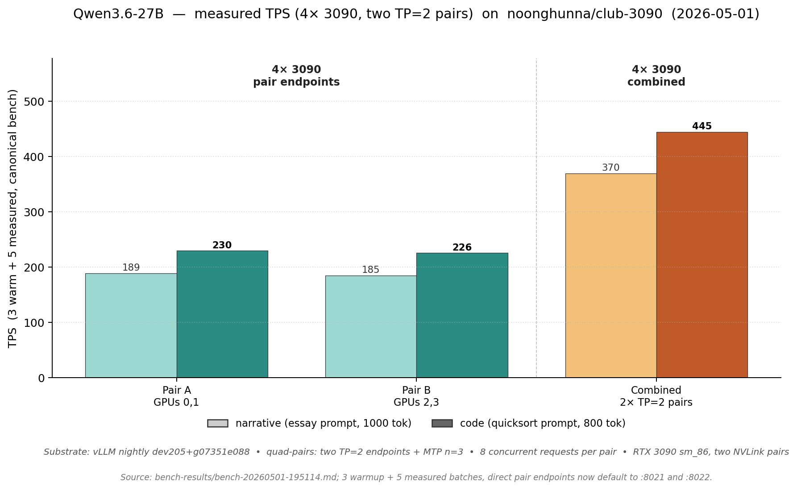
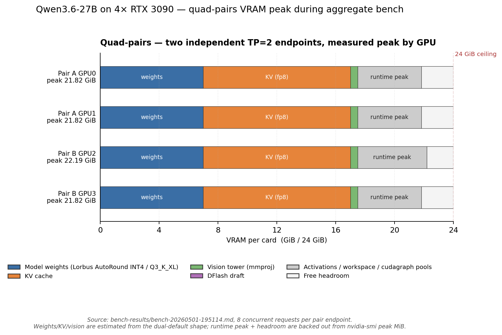

# Quad 3090 — two NVLink pairs, four cards total

You have **4× RTX 3090s arranged as two NVLink pairs**. This page covers the topology-aware configs added for that shape.

The inspected host topology on 2026-05-01:

| Pair | GPUs | Link | NUMA / CPU affinity | Use |
|---|---|---|---|---|
| Pair A | GPU0 ↔ GPU1 | NV4 | NUMA 0, CPUs `0-15,32-47` | first TP=2 group |
| Pair B | GPU2 ↔ GPU3 | NV3 | NUMA 1, CPUs `16-31,48-63` | second TP=2 group |
| Cross-pair | GPU0/1 ↔ GPU2/3 | SYS | crosses CPU interconnect | avoid tensor all-reduce here |

The key constraint: **do not treat all four GPUs as one flat TP=4 island.** TP=4 would all-reduce across the `SYS` links on every layer. The quad composes instead keep tensor-parallel groups inside the physical NVLink pairs.

---

## TL;DR — pick by serving shape

| What you're doing | Compose | Endpoint(s) | Parallelism | Max ctx | Streams | Spec-decode | TPS |
|---|---|---|---|---|---|---|---|
| **One OpenAI endpoint across all four cards** | [`quad.yml`](../models/qwen3.6-27b/vllm/compose/docker-compose.quad.yml) | `:8014` | PP=2 × TP=2 | 262K | 4 | none | **TBD** |
| **Maximum topology safety / routed pair split** | [`quad-pairs.yml`](../models/qwen3.6-27b/vllm/compose/docker-compose.quad-pairs.yml) | `:8020` router, `:8021` + `:8022` direct | two independent TP=2 servers | 262K each | 2 + 2 | MTP n=3 | 370 / 445 aggregate |

Run via `bash scripts/launch.sh` (interactive) or:

```bash
bash scripts/switch.sh vllm/quad
bash scripts/switch.sh vllm/quad-pairs
```

These are new variants. Do not cite TPS for `quad.yml` until `verify-full.sh`, `verify-stress.sh`, and `bench.sh` have passed on this host.

---

## Measured TPS on 4× 3090



`quad-pairs.yml` was measured against the direct pair endpoints with 8 concurrent requests per pair endpoint, 3 warmup + 5 measured batches, and the canonical narrative/code prompts. The combined aggregate result was **369.84 / 444.57 TPS** narrative/code. Pair A measured **189.08 / 229.71 TPS**; pair B measured **184.95 / 225.87 TPS**. The current direct host ports are `:8021` and `:8022`; older benchmark reports may show the pre-router default ports.

## VRAM budget on quad-pairs



Peak VRAM during the full quad-pairs bench was GPU0 **22,346 MiB**, GPU1 **22,346 MiB**, GPU2 **22,722 MiB**, GPU3 **22,345 MiB**. The slight GPU2 bump matches the measured bench telemetry; all cards stayed below the 24 GiB ceiling.

---

## Pick A Config

### Single endpoint — `quad.yml`

**Workload:** one server URL for a small team or agent farm, with all four cards contributing to one vLLM engine.

This uses `--pipeline-parallel-size 2` and `--tensor-parallel-size 2`. With `CUDA_VISIBLE_DEVICES=0,1,2,3`, vLLM ranks are intended to form two TP groups that line up with the physical NVLink pairs:

- stage 0: GPUs 0,1
- stage 1: GPUs 2,3

The compose sets `NCCL_P2P_LEVEL=NVL`, which allows NVLink P2P inside each pair without encouraging NCCL to use the slower `SYS` cross-pair path as if it were local. `--disable-custom-all-reduce` stays on; NCCL still uses NVLink for supported collectives, but we avoid vLLM's topology-sensitive custom path.

Expected shape: 262K + vision + fp8 KV + 4 streams. TPS is not published yet.

**Spec-decode caveat:** MTP is off in `quad.yml`. vLLM currently rejects `Qwen3_5MTP` with pipeline parallelism because the draft model does not implement `SupportsPP`; tracked in [`docs/UPSTREAM.md`](UPSTREAM.md). Use `quad-pairs.yml` when you need MTP on all four cards.

### Routed pair endpoints — `quad-pairs.yml`

**Workload:** simple, robust aggregate throughput with a single router URL for clients and direct pair URLs for benchmarks or manual split routing.

This launches two copies of the proven dual-card default:

| Service | GPUs | Port | Container |
|---|---|---|---|
| Router | n/a | `8020` | `vllm-qwen36-27b-quad-router` |
| Pair A | `0,1` | `8021` | `vllm-qwen36-27b-quad-pair-a` |
| Pair B | `2,3` | `8022` | `vllm-qwen36-27b-quad-pair-b` |

Each pair endpoint is the same shape as `dual.yml`: TP=2, 262K, fp8 KV, MTP n=3, vision, 2 streams. The router is a LiteLLM proxy that keeps the public model name `qwen3.6-27b-autoround` and uses least-busy routing across the two pair backends. The advantage is operational: no pipeline-parallel behavior and no runtime cross-pair GPU traffic.

Use the router for normal clients. Use the direct pair URLs when you need explicit per-pair benchmarking or manual traffic split. Default auth is `Authorization: Bearer sk-litellm` for the router and `Authorization: Bearer sk-vllm` for direct pair endpoints.

---

## Quick Start

```bash
# 1. Setup once
bash scripts/setup.sh qwen3.6-27b

# 2. Ensure the Marlin pad fork exists; all multi-card vLLM composes need it
sudo mkdir -p /opt/ai && sudo chown $USER /opt/ai
git clone -b marlin-pad-sub-tile-n https://github.com/noonghunna/vllm.git /opt/ai/vllm-src

# 3a. Single endpoint on all four GPUs
bash scripts/launch.sh --variant vllm/quad

# 3b. Or router + two dual endpoints, one per NVLink pair
bash scripts/launch.sh --variant vllm/quad-pairs
```

For `quad-pairs.yml`, send clients to:

```text
http://localhost:8020/v1
```

Direct pair endpoints stay available for explicit routing and measurement:

```text
http://localhost:8021/v1
http://localhost:8022/v1
```

---

## Verification

Minimum before publishing numbers:

```bash
# quad.yml
URL=http://localhost:8014 CONTAINER=vllm-qwen36-27b-quad bash scripts/verify-full.sh
URL=http://localhost:8014 CONTAINER=vllm-qwen36-27b-quad bash scripts/verify-stress.sh
URL=http://localhost:8014 CONTAINER=vllm-qwen36-27b-quad bash scripts/bench.sh

# quad-pairs.yml, pair A
API_KEY=sk-vllm URL=http://localhost:8021 CONTAINER=vllm-qwen36-27b-quad-pair-a bash scripts/verify-full.sh

# quad-pairs.yml, pair B
API_KEY=sk-vllm URL=http://localhost:8022 CONTAINER=vllm-qwen36-27b-quad-pair-b bash scripts/verify-full.sh

# quad-pairs.yml, router
API_KEY=sk-litellm URL=http://localhost:8020 CONTAINER=vllm-qwen36-27b-quad-pair-a bash scripts/verify-full.sh

# quad-pairs.yml, both pairs under concurrent load
bash scripts/bench.sh --quad-pairs
```

Bench protocol remains unchanged: 3 warm + 5 measured narrative/code batches, plus per-card peak VRAM. `--quad-pairs` sends 8 concurrent requests to each pair endpoint per batch and writes a timestamped Markdown report under `bench-results/`.

---

## Tuning Knobs

| Env var | Default | Use |
|---|---|---|
| `CUDA_VISIBLE_DEVICES` | `0,1,2,3` | Override GPU order for `quad.yml` if rank mapping needs to be changed. Keep NVLink pairs adjacent. |
| `CUDA_VISIBLE_DEVICES_A` | `0,1` | Pair A GPU list for `quad-pairs.yml`. |
| `CUDA_VISIBLE_DEVICES_B` | `2,3` | Pair B GPU list for `quad-pairs.yml`. |
| `PORT` | `8014` for `quad.yml`; `8021` for `quad-pairs.yml` | `quad.yml` endpoint, or pair A endpoint for `quad-pairs.yml`. |
| `PORT_B` | `8022` | Pair B endpoint for `quad-pairs.yml`. |
| `QUAD_PAIR_A_PORT` | `8021` | Pair A endpoint for `quad-pairs.yml`; preferred over the generic `PORT` override. |
| `QUAD_PAIR_B_PORT` | `8022` | Pair B endpoint for `quad-pairs.yml`; preferred over the older `PORT_B` override. |
| `ROUTER_PORT` | `8020` | Router endpoint for `quad-pairs.yml`. |
| `LITELLM_MASTER_KEY` | `sk-litellm` | Router API key for client requests to `:8020`. |
| `VLLM_API_KEY` | `sk-vllm` | Direct worker API key and router-to-worker backend key. |
| `ROUTER_MAX_CTX` | `262144` | Text context guard window used by the router. |
| `ROUTER_DEFAULT_MAX_TOKENS` | `16384` | Router-injected `max_tokens` when a client omits it. Prevents thinking-mode responses from burning a small default cap before final content. |
| `ROUTER_HEADROOM_TOKENS` | `20` | Extra router context slack reserved above prompt + requested output. |
| `VLLM_MAX_MODEL_LEN` | `262144` | Worker hard context window. Keep this at least as large as `ROUTER_MAX_CTX`. |
| `VLLM_GPU_MEMORY_UTILIZATION` | `0.92` | Worker KV-memory allocation fraction. Lower for more activation headroom; raising can reduce safety margin. |
| `VLLM_MAX_NUM_SEQS` | `2` | Worker concurrent sequence cap per pair endpoint. |
| `VLLM_MAX_NUM_BATCHED_TOKENS` | `8192` | Worker chunked-prefill scheduler budget. Lower can reduce prefill spikes at some TPS cost. |
| `VLLM_KV_CACHE_DTYPE` | `fp8_e5m2` | Worker KV cache dtype. Changing this materially changes VRAM/TPS and needs verify + bench. |
| `CLUB3090_NVIDIA_SMI_SUDO` | unset | Set to `1` if this host requires `sudo -n nvidia-smi` for preflight / bench telemetry. |

Router defaults and worker limits are separate. `ROUTER_DEFAULT_MAX_TOKENS` is only applied by the LiteLLM router when a client leaves `max_tokens` unset; it does not change worker capacity. The worker-side limits (`VLLM_MAX_MODEL_LEN`, `VLLM_MAX_NUM_SEQS`, `VLLM_MAX_NUM_BATCHED_TOKENS`, KV dtype, mem-util) govern what vLLM can actually serve and how much VRAM/headroom it reserves. Direct traffic to `:8021` or `:8022` bypasses the router guard, so direct clients should send explicit `max_tokens`.

If `quad.yml` fails on a vLLM pin, do not paper over it by switching to TP=4. Use `quad-pairs.yml` first, then reduce the failure to a vLLM issue if the PP=2 × TP=2 shape is still desired.

---

## See Also

- [`DUAL_CARD.md`](DUAL_CARD.md) — the proven TP=2 baseline each pair is built from.
- [`SINGLE_CARD.md`](SINGLE_CARD.md) — when a single 24 GB card is enough.
- [`HARDWARE.md`](HARDWARE.md) — hardware assumptions and NVLink notes.
- [`models/qwen3.6-27b/INTERNALS.md`](../models/qwen3.6-27b/INTERNALS.md) — TP all-reduce rationale, Marlin pad fork, DFlash/MTP notes.
