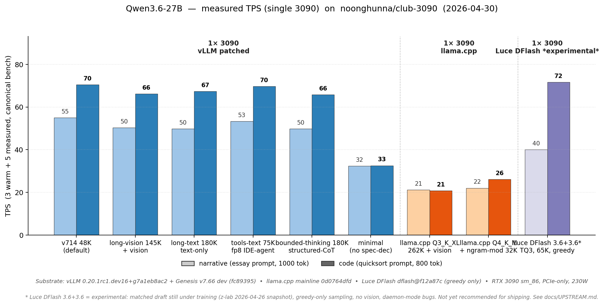
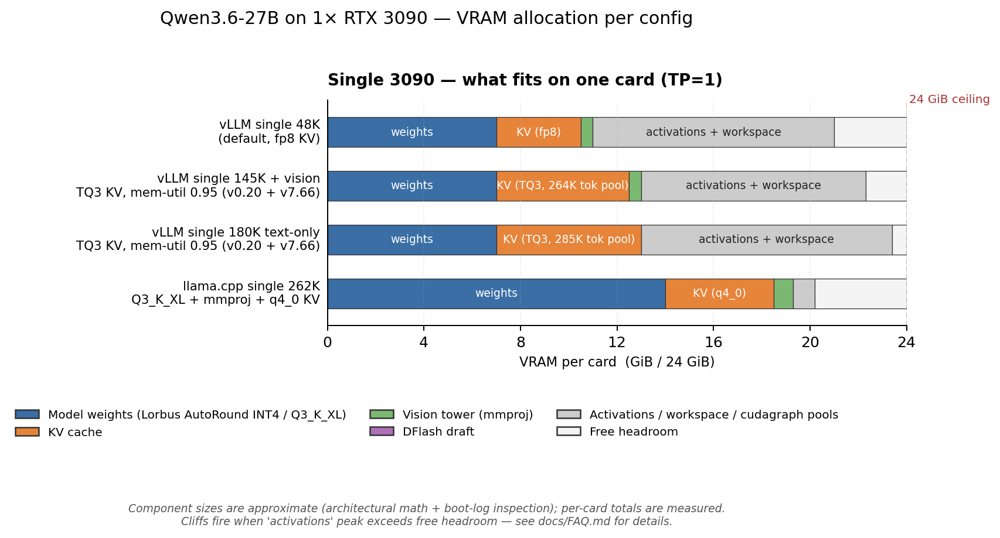

# Single 3090 — what fits, how to run it

You have **one RTX 3090 (24 GB VRAM)**. This page is the front door for picking a config and knowing what to expect. The model-specific deep dives (quants, Genesis patches, engine internals) live elsewhere — links at the bottom.

---

## TL;DR — pick by workload

Three recommended options:

| What you're doing | Compose | Max ctx | Narr / Code TPS | VRAM (24 GB / card) |
|---|---|---|---|---|
| **Long ctx + vision** (chat, agents, image input) | [`long-vision.yml`](../models/qwen3.6-27b/vllm/compose/docker-compose.long-vision.yml) | **198K** | 51 / 68 | ~22.3 GB (mem-util 0.98) |
| **Long ctx, text-only** (RAG, codebase, books) | [`long-text.yml`](../models/qwen3.6-27b/vllm/compose/docker-compose.long-text.yml) | **218K** | 50 / 66 | ~22.5 GB (mem-util 0.985) |
| **Bulletproof, no cliffs** (production service, unpredictable inputs) | [`llamacpp/default`](../models/qwen3.6-27b/llama-cpp/compose/docker-compose.yml) | **262K** | 21 / 21 | ~20 GB |

Run via `bash scripts/launch.sh` (interactive) or `bash scripts/switch.sh <variant>`.

> ## ⚠️ The one limitation to know
>
> **vLLM single-card variants will crash if you send a single prompt above ~50K tokens.**
>
> This is Cliff 2 — DeltaNet GDN forward OOMs at 50–60K single-shot regardless of how much VRAM you have left. Both `long-vision.yml` (198K) and `long-text.yml` (218K) are designed for **steady-state accumulation across many turns** — context that builds up across tool calls, replies, retrieved chunks. They are NOT designed for "paste an 80K-token document and ask one question."
>
> **If your workload ever sends single big prompts:** use `llamacpp/default` (262K, no cliffs anywhere — different engine entirely) or move to dual-card (`dual.yml` TP=2, verified at 237K).
>
> Cliff 1 (the 25K-token tool-prefill OOM that historically blocked these variants) is closed as of 2026-04-30 PM via the PN12 anchor sidecar. Tool-using agents that send big tool returns are fine on `long-vision` / `long-text`.

---

## Measured TPS on single 3090



Bench protocol: 3 warm + 5 measured runs of the canonical narrative + code prompts on each config. Substrate: vLLM nightly `dev205+g07351e088` + Genesis pinned to `917519b` (v7.62.x), llama.cpp mainline `0d0764dfd`, RTX 3090 sm_86 PCIe-only at 230 W. Per-config run-by-run + VRAM peaks: [models/qwen3.6-27b/CHANGELOG.md](../models/qwen3.6-27b/CHANGELOG.md).

---

## VRAM budget on 24 GB



What this says about single-card constraints:

- **Model weights** consume ~14 GB (AutoRound INT4 / GGUF Q3_K_XL). Half the card.
- **KV cache** is the next biggest line; its size depends on `--kv-cache-dtype` × ctx. fp8 ≈ 1 byte/token/(layer×head); TQ3 ≈ 0.4 bytes/token/(layer×head); fp16 ≈ 2 bytes/token/(layer×head).
- **Vision tower** (mmproj) costs ~0.5–1.0 GB extra when on.
- **Activations + cudagraph pools** is what's left. At `--gpu-memory-utilization 0.92` (default 48K) you have 2-3 GB of activation headroom — comfortable. At 0.98–0.985 (long-vision / long-text), <0.5 GB — historically where Cliff 1 fired. **As of 2026-04-30 PM**, anchor-fixed PN12 (which actually pools FFN intermediates instead of fresh-allocating per layer) cuts allocator churn enough that long-vision survives 0.98 + 198K and long-text survives 0.985 + 218K. Pushing mem-util past 0.985 fails on this hardware (driver/system reserves ~440 MiB).

For the cross-card TP=2 picture, see [`DUAL_CARD.md`](DUAL_CARD.md).

---

## Pick a config

### Long ctx + vision — `long-vision.yml` ⭐

**Workload:** chat with images, vision-aware coding agents, multimodal RAG. Anything where the user might paste a screenshot.

198K + vision tower + TQ3 KV + Genesis MTP n=3 + PN12 anchor sidecar + P104 sidecar. Cliff 1 closed (25K-token tool prefills survive). `verify-full.sh` all 8 checks pass; `verify-stress.sh` tool-prefill passes at 643 chars.

### Long ctx, text-only — `long-text.yml` ⭐

**Workload:** RAG ingest, codebase analysis, book/document Q&A, long conversations without image input.

218K + no vision + TQ3 KV + same sidecars. Vision drop frees ~1 GB, lifting the ceiling 20K above long-vision (198K → 218K) and letting us run at 0.985 mem-util. Same Cliff 1 closure mechanism. MTP AL 2.66, VRAM 23.7/24 GB.

### Bulletproof / no cliffs — `llamacpp/default` ⭐

**Workload:** production service for unpredictable users. Inputs that might be 5K or might be 200K. Tool returns that might be 1K or might be 50K. Anywhere "predictable behavior" beats "peak TPS."

`bash scripts/switch.sh llamacpp/default`. Q3_K_XL (Unsloth dynamic) + q4_0 KV at 262K + vision (mmproj). Different attention library entirely (ggml-cuda, not FA2) → no Cliff 1 mechanism, no Cliff 2 mechanism. Trade is ~21 TPS (~2.5× slower than vLLM). Quant validated by [Benjamin Marie's Kaitchup eval](https://kaitchup.substack.com/p/summary-of-qwen36-gguf-evals-updating).

---

## Other variants in the repo (not recommended for shipping)

These exist for troubleshooting, niche workloads, or historical comparison. Not promoted as primary because the long-* variants now cover their use cases:

- **`docker-compose.yml`** — 48K + TQ3 + vision, mem-util 0.92. The "below both cliffs by definition" baseline (engine HTTP-400-rejects requests >48K, so Cliff 2 is unreachable). Useful when you want bulletproof error behavior on a specific small-ctx workload, or as a fast-boot diagnostic. Most users should pick `long-vision` or `llamacpp/default` instead.
- **`tools-text.yml`** — 75K + FP8 KV + PN8. Was the only Cliff-1-safe single-card path before PN12 anchor fix landed. FP8 KV is closer in quality to FP16 than TQ3 is, so kept around for accuracy-sensitive comparisons. Most IDE-agent workloads now run fine on `long-text.yml`.
- **`minimal.yml`** — 32K + FP8 + no Genesis + no spec-decode. Stripped-down stack for isolating "is this a Genesis bug?" questions. Half the throughput of any other variant.

## Watch list — Luce DFlash (not yet a recommendation)

Re-tested 2026-04-30 PM against [`Luce-Org/lucebox-hub`](https://github.com/Luce-Org/lucebox-hub) on Qwen3.6-27B Q4_K_M target + matched z-lab/Qwen3.6-27B-DFlash draft. **Closer to parity than 2026-04-22 — but several gaps still keep it off the recommended list:**

Measured TPS on this rig (RTX 3090, greedy, single-stream, n_gen=1000):

| Workload | Luce DFlash 3.6+3.6 (TQ3 KV, max_ctx=65K) | vLLM long-text 218K |
|---|---|---|
| Narrative essay | 37–47 TPS (mean ~40) | 50 TPS |
| Code (heap/LRU/AST) | 63–76 TPS (mean ~72) | 66 TPS |
| AL (code) | 5.9–7.1 | 3.4–3.8 (MTP) |

What works since 2026-04-22:
- ✅ **Tool calls** via `server_tools.py` — parses Qwen `<tool_call>` format → returns OpenAI `tool_calls[]`. The big server-UX gap from last bench is closed.
- ✅ **Streaming SSE** with `reasoning_content` deltas.
- ✅ **Daemon mode** with cache-reuse for fast cold starts.
- ✅ **Verify-stress 25K tool-prefill passes** at TQ3 KV + max_ctx=65K.

What still keeps it off the recommended list:
- ❌ **Greedy only** — `temperature` / `top_p` ignored. Real downside for creative-writing workloads.
- ❌ **3.6 draft under-trained** (z-lab snapshot 2026-04-26). Narrative AL ~3.7 vs code ~7.0; narr loses ~20% TPS to vLLM until training completes.
- ❌ **No vision** tower.
- ❌ **`enable_thinking` chat_template_kwargs handled differently** than vLLM — verify-full check 6 fails.
- ❌ **Prefill cliff at higher max_ctx** — 25K tool prefill OOMs in `fattn-chunked.cu` at Q8_0 KV + max_ctx=65K (TQ3 KV closes it). At max_ctx=131K + TQ3, the daemon subprocess crashes (broken-pipe to FastAPI) on 30K+ probes.
- ❌ **Build fragility** — fresh `git clone` of `dflash` main HEAD fails to compile (`ggml_turbo_wht` / `GGML_TYPE_TQ3_0` undefined) until you `git submodule update --init` after manual `git fetch` in `dflash/deps/llama.cpp`.
- ❌ **Daemon-mode "empty prompt" regression** — after streaming requests, subsequent requests sometimes return 0 tokens; needs server restart.

**Re-test trigger:** z-lab tags the Qwen3.6-27B-DFlash draft as training-complete OR Luce-Org publishes a tagged release with the daemon-mode bug fixed. Track in [`docs/UPSTREAM.md`](UPSTREAM.md#luce-dflash-luce-orglucebox-hub).

---

## What single-card can't do

| Want | Why not on 1× | What you'd need |
|---|---|---|
| 4 concurrent streams at 262K + vision | KV pool too small for 4 × full ctx | TP=2 (see DUAL_CARD.md) |
| Peak code TPS (>100 TPS on quicksort prompt) | DFlash N=5 needs head_size=256 + non-causal — vLLM head-dim split | TP=2 + DFlash |
| Single-prompt >60K tokens on vLLM | Cliff 2 (DeltaNet GDN forward), no fix yet | TP=2 OR llama.cpp 262K (different engine) |

---

## Common pitfalls (single-card specifics)

### Prefill cliffs

- **Cliff 1** — FFN intermediate-buffer activation peak (138 MiB allocate at `intermediate_size × max-num-batched-tokens`). Historically fired on long-ctx composes at >0.95 mem-util when prefill batch needed the buffer. **Closed on `tools-text.yml`** (FP8 KV path) since 2026-04-29 via Genesis PN8. **Closed on TQ3 paths** (`long-vision.yml` 198K, `long-text.yml` 218K) since 2026-04-30 PM via PN12 anchor sidecar — see [`docs/CLIFFS.md`](CLIFFS.md).
- **Cliff 2** — DeltaNet GDN forward OOM at 50-60K single-prompt regardless of mem-util. In `fla.ops` upstream, no file-replacement patch available. Watch [vllm#40914](https://github.com/vllm-project/vllm/pull/40914) and [FlashQLA](https://github.com/QwenLM/FlashQLA) for upstream fixes.

### VRAM peak vs idle

`nvidia-smi` at boot ≠ peak. Boot shows weights + KV pool reservation. **Peak adds activation buffers during prefill** — typically +500-1500 MiB. If `nvidia-smi` shows 23.5/24 GB at idle, you have ~500 MiB for prefill activations — not enough for the 138 MiB-class buffer at long ctx. Drop mem-util by 0.03 if you need the headroom.

### Tool-call extraction needs `--enable-auto-tool-choice`

vLLM ships this off by default. Our composes set `--tool-call-parser qwen3_coder` + `--enable-auto-tool-choice`. If you're rolling your own compose, both are required.

---

## Quick start

```bash
# 1. Setup (downloads model, clones Genesis, ~20 min cold)
bash scripts/setup.sh qwen3.6-27b

# 2. Pick + boot via wizard (asks engine + workload)
bash scripts/launch.sh

# 3. Or skip the wizard:
bash scripts/launch.sh --variant vllm/tools-text   # IDE agent path
bash scripts/launch.sh --variant llamacpp/default  # easy mode

# 4. Sanity test
curl -sf http://localhost:8020/v1/chat/completions \
  -H "Content-Type: application/json" \
  -d '{"model":"qwen3.6-27b-autoround","messages":[{"role":"user","content":"Capital of France?"}],"max_tokens":30}'

# 5. Switch later without re-running setup
bash scripts/switch.sh vllm/long-vision    # for example
bash scripts/switch.sh --list              # show all variants
```

---

## Models supported on single 3090

- **[Qwen3.6-27B](../models/qwen3.6-27b/)** — primary model. Quant choices, Genesis patches, engine internals all in the model directory.
- More models coming. As they're added, this section will list which single-card configs each one supports.

---

## Deep dives

- **[Model README](../models/qwen3.6-27b/)** — quant choices (AutoRound INT4 / GGUF Q3_K_XL), Genesis patch surface, what's working / what's not.
- **[INTERNALS.md](../models/qwen3.6-27b/INTERNALS.md)** — engineering rationale (Genesis P65/P66/PN8, Marlin pad fork, MTP, the cascade bug, upstream tracker).
- **[VRAM allocation diagram](../models/qwen3.6-27b/README.md#vram-allocation-across-configs)** — full per-config breakdown across single + dual.
- **[FAQ.md](FAQ.md)** — common questions (4090 / 5090 support, why MTP not EAGLE, Copilot Gateway, what's a cliff, etc.).
- **[EXAMPLES.md](EXAMPLES.md)** — Python / TS / curl client snippets + IDE connection settings.
- **[HARDWARE.md](HARDWARE.md)** — Ampere SM 8.6 specifics, NVLink (declined), power caps.
- **[DUAL_CARD.md](DUAL_CARD.md)** — when you need what single-card can't deliver.
