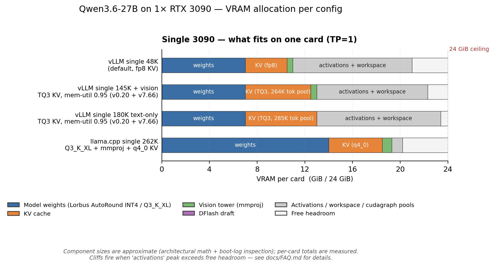

# Single 3090 — what fits, how to run it

You have **one RTX 3090 (24 GB VRAM)**. This page gets you to a running config and tells you what it can't do. Deep dives (quants, engine internals, cliff mechanisms) are linked at the bottom.

> **Want a model that isn't listed here?** → [`PULL.md`](PULL.md): `scripts/pull.sh` evaluates any HF safetensors repo against the KV math without downloading, and boots it if it passes.

## What runs on one 3090 today

| Model | Slug | Max ctx | Vision | Status |
|---|---|--:|---|---|
| **Gemma-4-12B** ⭐ long-context pick | `vllm/gemma-12b-single-int8-mtp` | **256K** | multimodal arch, served text-only | ⚠️ caveats |
| **Gemma-4-26B-A4B** | `vllm/gemma-26ba4b-single` | **176K** | off | ⚠️ caveats |
| **Qwen3.6-27B** | `vllm/minimal` | **32K** | ❌ none | ✅ production |
| **Qwen3.8-27B** 🆕 | `llamacpp/qwen38-27b-single-iq4nl` | **131K** | ❌ none | 🐣 `--force`, hidden from `--list` |

⭐ **Need long context on one card? Run Gemma-4-12B, not Qwen3.6.** Qwen3.6-27B's single-card ceiling is 32K with no vision — its 200K llama.cpp / ik-llama routes were retired 2026-08-12 (still launchable, see [Escape hatches](#escape-hatches)).

🆕 **Qwen3.8-27B does have a single-card path** — `llamacpp/qwen38-27b-single-iq4nl` (unsloth IQ4_NL + q8_0 KV, 131K, port 8086). It's `🐣 incubating`: hidden from `switch.sh --list`, launch with `--force`, and **unbenched on one card**. The model's measured numbers are all dual-card — see [DUAL_CARD.md](DUAL_CARD.md) and the [announcement](https://github.com/noonghunna/club-3090/discussions/1024).

```bash
bash scripts/switch.sh --force llamacpp/qwen38-27b-single-iq4nl
```

⚠️ **Three NVFP4 single-card slugs exist and none run on a 3090.** `vllm/qwen-27b-single-nvfp4` and `vllm/qwen-35b-a3b-single-nvfp4` declare `required_sm=9.0` (a 3090 is **sm 8.6**); `vllm/qwen38-27b-single-nvfp4` (64K, port 8098) needs a **32 GB** card and has never booted anywhere. All three are for Hopper / Blackwell / 32 GB-class hardware.

Models with **no** single-card config at all: `qwen3.6-40b-deckard`, `tess-4-27b`, `deepseek-v4-flash-0731`, `inkling-small`, `gemma-4-31b` — dual or multi only.

---

## ⚠️ Read this before you pick: accumulating-context agents

If your workload is **hermes / openhands / OpenCode / Cline / Roo / OpenClaw / Aider / Cursor with retained context**, single-card vLLM is **not safe**. A hardware-physical cliff ("Cliff 2b") hits at **~21–26K accumulated tokens**, across 4–5 turns, on every single-card vLLM config. Validated 2026-05-03 across all six that shipped at the time — see [#41](https://github.com/noonghunna/club-3090/issues/41).

Symptoms: *"degrades after ~20 turns"*, *"throughput drops to 0"*, *"unresponsive then 500s"*, *"OOM after 4-5 turns"*. Same root cause each time. Mechanism: [`CLIFFS.md`](CLIFFS.md).

| Have | Run | Why it works |
|---|---|---|
| 2× 3090 (any topology) | `bash scripts/switch.sh vllm/dual` | TP=2 splits the failing kernel's working set across both cards. Soak PASS, 111+ TPS p50 decode. → [DUAL_CARD.md](DUAL_CARD.md) |
| 1× 3090, **a different model** | `bash scripts/switch.sh vllm/gemma-12b-single-int8-mtp` | Gemma-4 isn't Qwen3-Next — no DeltaNet GDN kernel, so the cliff doesn't exist. **256K.** The straightforward answer unless you specifically need Qwen. |
| 1× 3090, **must be Qwen** | `bash scripts/switch.sh --force llamacpp/default` | Retired but genuinely cliff-immune — different engine, different kernel, different allocator. 200K. Unsupported; see [Escape hatches](#escape-hatches). |
| 1× 3090, supported Qwen path | `bash scripts/switch.sh vllm/minimal` | ⛔ **Does NOT escape the cliff** — this *is* single-card vLLM. Safe only for workloads that don't accumulate context. |

⚠️ **Tuning does not close this.** Mem-util, MTP-off and `max-num-batched-tokens` were all tested and none of them work. The only app-layer mitigations are capping session context below ~15K via rolling summarization, or accepting periodic engine restarts.

For workloads that **don't** accumulate context — single-shot RAG, simple chat, batch processing — single-card vLLM is fine.

---

## Quick start

```bash
# 1. Setup (downloads weights, ~20 min cold)
bash scripts/setup.sh qwen3.6-27b

# 2. Pick + boot via wizard (asks model + GPUs, projects VRAM budget)
bash scripts/launch.sh

# 3. Or skip the wizard:
bash scripts/launch.sh --variant qwen3.6-27b/default  # resolves to vllm/minimal
bash scripts/launch.sh --variant vllm/minimal         # same thing, named explicitly (32K, no vision)

# 4. Sanity test
curl -sf http://localhost:8020/v1/chat/completions \
  -H "Content-Type: application/json" \
  -d '{"model":"qwen3.6-27b","messages":[{"role":"user","content":"Capital of France?"}],"max_tokens":200}'

# 5. Switch later without re-running setup
bash scripts/switch.sh vllm/minimal        # for example
bash scripts/switch.sh --list              # every launchable variant (--all includes retired)
```

Guided 5-minute version, no decisions: [`GETTING_STARTED.md`](GETTING_STARTED.md).

---

## What single-card can't do

| Want | Why not on 1× | What you'd need |
|---|---|---|
| 4 concurrent streams at 262K + vision | KV pool too small for 4 × full ctx | TP=2 → [DUAL_CARD.md](DUAL_CARD.md) |
| Peak code TPS (>100 on the quicksort prompt) | DFlash needs `head_size=256` + non-causal; vLLM splits the head dim | TP=2 + DFlash |
| Single prompt >60K tokens on Qwen3.6-27B | Cliff 2 (DeltaNet GDN forward) | TP=2 (`vllm/dual`), a non-Qwen3-Next model (`vllm/gemma-12b-single-int8-mtp`, 256K), or `--force llamacpp/default` |
| Qwen3.8-27B on **vLLM**, or at 262K | FP8 weights + a 262K KV pool don't fit 24 GB | 2 cards → [DUAL_CARD.md](DUAL_CARD.md). One card gets the llama.cpp IQ4_NL route at 131K. |

---

## VRAM budget on 24 GB



- **Weights** ~14 GB (AutoRound INT4 / GGUF Q3_K_XL) — over half the card.
- **KV cache** is next, sized by `--kv-cache-dtype` × ctx: fp8 ≈ 1 byte, TQ3 ≈ 0.4 bytes, fp16 ≈ 2 bytes per token per (layer × head). Full math: [`KV_MATH.md`](KV_MATH.md).
- **Vision tower** (mmproj) adds ~0.5–1.0 GB when on.
- **Activations + cudagraph pools** take what's left — and this is where single-card configs actually die. See the peak-vs-idle pitfall below.

Cross-card TP=2 picture: [`DUAL_CARD.md`](DUAL_CARD.md).

---

## Single-card pitfalls

### ⚠️ VRAM peak ≠ idle — the "booted fine, then OOM'd" trap

`nvidia-smi` at boot shows weights + KV reservation, **not peak**. Peak adds activation buffers during prefill, typically **+500–1500 MiB**. A card idling at 23.5 / 24 GB has ~500 MiB of headroom — not enough for the 138 MiB-class buffer a long prefill allocates. The server boots, serves short prompts, and dies on the first big one.

**Fix:** drop `--gpu-memory-utilization` by `0.03`. Judge headroom from a loaded card, never an idle one.

### Tool-call extraction needs `--enable-auto-tool-choice`

vLLM ships it off. Our composes set `--tool-call-parser qwen3_coder` + `--enable-auto-tool-choice`; both are required if you roll your own.

### Prefill cliffs

Cliff 1 (FFN intermediate buffer) and Cliff 2 (DeltaNet GDN forward) are the two OOM shapes on this hardware. Mechanisms, current status and re-test triggers: [`CLIFFS.md`](CLIFFS.md).

### Running alongside a desktop, or sub-24 GB usable VRAM

Compose defaults assume a **headless** card. If the same GPU drives a display, shrink the budget:

```bash
MAX_MODEL_LEN=32768 GPU_MEMORY_UTILIZATION=0.85 bash scripts/switch.sh vllm/minimal
```

Prefer dropping `MAX_MODEL_LEN` first — it's a clean KV reduction. `GPU_MEMORY_UTILIZATION` interacts with vLLM's profiling phase in non-obvious ways, and `0.80` is usually too aggressive (profiling eats more than the 0.05 you saved). Card-class detail: [`HARDWARE.md`](HARDWARE.md).

### Running two variants at once

Ports and container names are configurable per instance — see [`PODS.md`](PODS.md). Two full-context single-card servers will not co-reside on one 24 GB card.

---

## Escape hatches

Every llama.cpp and ik-llama single-card slug was retired 2026-08-12, and `ik-llama` left every recommendation walk. **They still work.** They are hidden from `switch.sh --list` and need `--force`:

```bash
bash scripts/switch.sh --force llamacpp/default   # 200K, cliff-immune, ~51 / 60 TPS
bash scripts/switch.sh --list --all               # see everything, including retired
```

This matters because the retirement **removed capability with no replacement**: single-card Qwen3.6-27B went from 200K ctx and 150K vision at ~60 / 72 TPS down to `vllm/minimal` at 32K, no vision, ~32 / 33 TPS. If you need what the retired slugs did, `--force` is the honest answer — unmaintained, but not broken.

Measurements for the retired configs are preserved in [`BENCHMARKS.md`](../BENCHMARKS.md) and [`models/qwen3.6-27b/CHANGELOG.md`](../models/qwen3.6-27b/CHANGELOG.md).

---

---

## Keeping up

Slugs, defaults and measured numbers move faster than this page. For the latest:

- 📣 **[Announcements](https://github.com/noonghunna/club-3090/discussions/categories/announcements)** — new models and tiers land here first, with the numbers and the caveats. Recent: [Qwen3.8-27B](https://github.com/noonghunna/club-3090/discussions/993) · [the fast + NVFP4 tier](https://github.com/noonghunna/club-3090/discussions/1024).
- 💬 **[Discord](https://discord.gg/gzdfjhj5yN)** — synchronous Q&A, hardware questions, what people are actually running.
- 📋 **[Discussions](https://github.com/noonghunna/club-3090/discussions)** — cross-rig benchmark drops and "should I tune X" threads, searchable.
- ⚙️ **`bash scripts/switch.sh --list`** — the authoritative slug matrix for *your* machine. Always more current than any hand-written table, including the ones above.

## Deep dives

- **[CLIFFS.md](CLIFFS.md)** — Cliff 1 / 2 / 2b mechanisms, fix landscape, re-test triggers.
- **[KV_MATH.md](KV_MATH.md)** — predicting per-card VRAM before you boot.
- **[GLOSSARY.md](GLOSSARY.md)** — TPS, KV, MTP, TP, prefill vs decode.
- **[FAQ.md](FAQ.md)** — 4090 / 5090, engine choice, why my TPS is low, troubleshooting ladder.
- **[EXAMPLES.md](EXAMPLES.md)** — Python / TS / curl clients + IDE settings.
- **[HARDWARE.md](HARDWARE.md)** — card classes, power caps, VRAM ceilings.
- **[Model README](../models/qwen3.6-27b/)** · **[INTERNALS.md](../models/qwen3.6-27b/INTERNALS.md)** — quant choices, engine internals.
- **[DUAL_CARD.md](DUAL_CARD.md)** — when you need what one card can't deliver.
