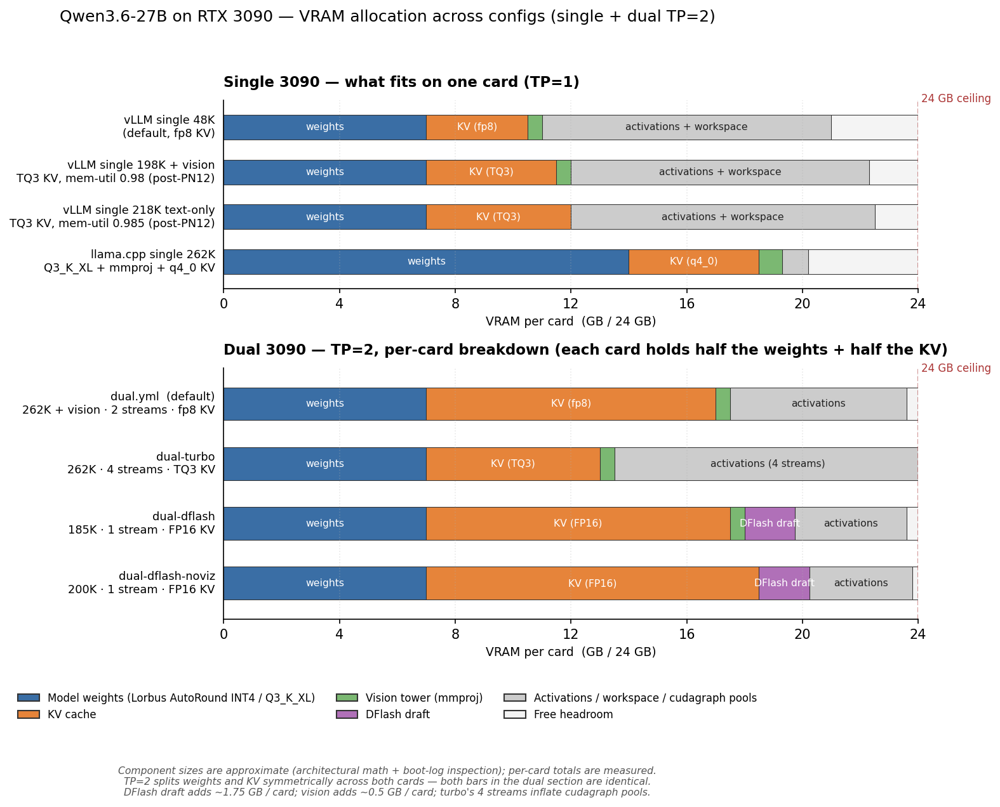

# Qwen3.6-27B

**Run [Qwen3.6-27B](https://huggingface.co/Qwen) — with vision and tool calling — on 1 or 2 RTX 3090s.** Full OpenAI-compatible API, drop-in replacement for ChatGPT/Claude in any tool that uses the OpenAI SDK.

> 👉 **For deployment options + workload-driven config picks**, see the hardware-axis pages:
> [`docs/SINGLE_CARD.md`](../../docs/SINGLE_CARD.md) (1× 3090) · [`docs/DUAL_CARD.md`](../../docs/DUAL_CARD.md) (2× 3090).
>
> This page is the **model-specific reference**: quants, what's working / not working, VRAM allocation, engine pointers.

---

## What this is

- **27B parameter dense LLM** with vision support (Qwen3-Next family — hybrid DeltaNet + standard attention)
- **Quant on this stack:** [`Lorbus/Qwen3.6-27B-int4-AutoRound`](https://huggingface.co/Lorbus/Qwen3.6-27B-int4-AutoRound) — INT4 weights with BF16 `mtp.fc` head preserved (lets vLLM use MTP spec-decode)
- **GGUF alternative:** [`unsloth/Qwen3.6-27B-GGUF`](https://huggingface.co/unsloth/Qwen3.6-27B-GGUF) — Q3_K_XL ⭐ (validated by [Marie's Kaitchup eval](https://kaitchup.substack.com/p/summary-of-qwen36-gguf-evals-updating)), Q4_K_M, Q5_K_S
- **Engines:** vLLM (full features) · llama.cpp (max context, lighter footprint) · SGLang (currently blocked, watch list)

---

## Quick start

The easiest entry is the wizard at the repo root, which asks engine + workload and boots the right compose:

```bash
bash scripts/setup.sh qwen3.6-27b
bash scripts/launch.sh
```

If you already know the variant you want, see [`docs/SINGLE_CARD.md`](../../docs/SINGLE_CARD.md) or [`docs/DUAL_CARD.md`](../../docs/DUAL_CARD.md) for the menu, then:

```bash
bash scripts/switch.sh vllm/tools-text   # for example
```

Sanity check after boot:

```bash
curl -sf http://localhost:8020/v1/chat/completions \
  -H "Content-Type: application/json" \
  -d '{"model":"qwen3.6-27b-autoround","messages":[{"role":"user","content":"Capital of France?"}],"max_tokens":30}'
```

---

## VRAM allocation across configs

How each config splits the 24 GB / card budget — weights, KV cache, vision tower, DFlash draft (where applicable), and activation/cudagraph headroom. Single-card (TP=1) on top, dual-card (TP=2, weights and KV halved across both GPUs) on bottom.



As of 2026-04-30 PM, single-card vLLM ceilings are:
- **218K text-only** (`long-text.yml`, no vision) — verified cliff-safe via anchor-fixed PN12 + P104 sidecars at 0.985 mem-util.
- **198K with vision** (`long-vision.yml`) — verified cliff-safe at 0.98 mem-util (vision tower's persistent ~1 GB makes 0.985 too tight).
- 75K FP8 IDE-agent path (`tools-text.yml`) and 48K production-safe baseline (`docker-compose.yml`) still distinct options for their use cases.

TP=2 still unlocks the **262K + 4 concurrent streams** combo and remains the path for single-prompt prefills above 50–60K (Cliff 2 still applies on single-card regardless of Cliff 1 status).

---

## What's working

- **Vision** — images in messages via OpenAI-compat format. Tower is small (~0.5–1.0 GB VRAM); each image consumes 640–1280 tokens at default resolution. Quality is good for charts / screenshots / natural images, less reliable for OCR on dense text. No image *generation* — this model is vision-input-only.
- **Tool calling** — `tools=[...]` + `tool_choice="auto"`, parsed cleanly into `tool_calls[]`. Genesis v7.62.x ships PN11 (Quentin-M's streaming-tool-call IndexError fix from vllm#41142).
- **Streaming** — SSE chunks add up to coherent text; tool-call deltas stream too.
- **Reasoning mode** — `chat_template_kwargs.enable_thinking=true` for chain-of-thought (vLLM extracts into `reasoning_content` field; llama.cpp emits inline).
- **Spec-decode** — MTP n=3 default on vLLM (~83% per-position-1 accept on code); DFlash N=5 on dual-card for code-heavy workloads.
- **All standard sampling** — temperature, top_p, top_k, repetition_penalty, JSON-mode, structured output.

## What's not working today

- **GGUF on vLLM** for Qwen3-Next family — not supported upstream. Use llama.cpp for GGUF on this model.
- **EAGLE spec-decode on hybrid attention** — DeltaNet rollback issue (cross-engine architectural). Watch upstream.
- **Single-card single prompts >50-60K** — Cliff 2 (DeltaNet GDN forward state). Lives in `fla.ops` upstream, no file-replacement patch. Watch [vllm#40914](https://github.com/vllm-project/vllm/pull/40914) and [FlashQLA](https://github.com/QwenLM/FlashQLA). Mitigation: dual-card or llama.cpp 262K. **Cliff 1** (tool-prefill OOM at ~25K-token tool returns) was the other historical caveat; closed 2026-04-30 PM via PN12 anchor sidecar + P104 sidecar — see [`docs/CLIFFS.md`](../../docs/CLIFFS.md).

---

## Quant decision

Why AutoRound INT4 over alternatives:

| Quant | Stack support | Bench | Trade-off |
|---|---|---|---|
| **Lorbus AutoRound INT4** ⭐ | vLLM `--quantization auto_round` | 51-89 TPS depending on config | +9% over AWQ (this model); BF16 MTP head preserved; required for MTP spec-decode |
| AWQ INT4 | vLLM `--quantization awq` | 38 TPS @ 8K | Works; slower; no spec-decode advantage |
| GPTQ INT4 (palmfuture) | vLLM `--quantization gptq` | 137 TPS @ 262K dual-card | Older path; AWQ + DFlash had a pad-Marlin × aux-layer bug we never reduced |
| GGUF Q3_K_XL (Unsloth dynamic) | llama.cpp only | 21 TPS @ 262K | One Docker line, no patches, no Cliff 1/2; ⭐ Marie's Kaitchup eval picks this as optimal accuracy/footprint |
| GGUF Q4_K_M | llama.cpp only | ~28 TPS measured 2026-04-23 (regression to ~21 today on current commit) | Heavier than Q3_K_XL; quality close |

For deeper rationale, comparison tables, and the patched-vLLM-source story (vllm#40361 Marlin pad-sub-tile-n), see [INTERNALS.md](INTERNALS.md).

---

## Genesis patch surface (vLLM)

The vLLM single-card composes mount Sandermage's [Genesis tree](https://github.com/Sandermage/genesis-vllm-patches) and apply specific patches at boot. Currently pinned at commit `917519b` (v7.62.x release, 2026-04-29) per `scripts/setup.sh`.

Active patches per compose:

| Patch | What it does | Composes |
|---|---|---|
| P64 | Streaming tool-call edge case | all single-card vLLM with MTP |
| P65 | TurboQuant spec-CG downgrade (#40880 fix) | TQ3 paths (default, long-vision, long-text) |
| P66 | Cudagraph capture-size divisibility | TQ3 paths |
| **P101** | TQ continuation 64-token slicing (anchor-fixed via PR #12) | TQ3 paths (long-vision, long-text) |
| **P103** | FLA Cliff 2 chunked fwd_h+fwd_o orchestrator | TQ3 paths (long-vision, long-text) |
| **PN12** | FFN intermediate scratch pool (anchor-fixed via PR #13) — closes Cliff 1 mech B on TQ3 | TQ3 paths (long-vision, long-text) |
| **PN13** | CUDAGraphWrapper lambda-arity (vllm#41235 backport) | TQ3 paths |
| **PN8** | MTP draft online-quant propagation (vllm#40849) — closes Cliff 1 on FP8 path | **fp8 path** (`tools-text.yml`) |
| (P68/P69 disabled 2026-04-29) | Default-on tool-choice rewriting broke IDE agents | all — commented out |

Two local sidecars apply outside Genesis:
- **`patch_pn12_ffn_pool_anchor.py`** — repairs PN12 anchor on dev205+ until [PR #13](https://github.com/Sandermage/genesis-vllm-patches/pull/13) merges. Idempotent (skips if Genesis-side PN12 already applied).
- **`patch_fa_max_seqlen_clamp.py`** — local P104 FA softmax_lse clamp, defensive coverage of Cliff 1 mech A. Held back from upstream PR pending Sandermage's response on issue #11.

Dual-card composes (`dual.yml`, `dual-dflash*`) are **Genesis-less by design** — fp8 KV + TP=2 + 0.92 mem-util has plenty of headroom and doesn't trigger the cudagraph bugs Genesis was built to patch. `dual-turbo.yml` does mount Genesis (TQ3 path needs P65).

Forensic chain + per-patch attribution → [INTERNALS.md](INTERNALS.md).

---

## See also

- **[/docs/SINGLE_CARD.md](../../docs/SINGLE_CARD.md)** — 1× 3090 deployment menu (workloads → composes → TPS).
- **[/docs/DUAL_CARD.md](../../docs/DUAL_CARD.md)** — 2× 3090 deployment menu.
- **[INTERNALS.md](INTERNALS.md)** — engineering deep dive (Genesis patches, forensics, Marlin pad, DFlash, upstream tracker).
- **[CHANGELOG.md](CHANGELOG.md)** — dated history (combines single + dual timelines).
- **[/docs/EXAMPLES.md](../../docs/EXAMPLES.md)** — Python / TS / curl client snippets + Open WebUI / Cline / Cursor connection settings.
- **[vllm/](vllm/)** — vLLM-specific recipes (compose YAMLs are documented in their own headers).
- **[llama-cpp/](llama-cpp/)** — llama.cpp recipes (max context on single card, no prefill cliffs).
- **[sglang/](sglang/)** — SGLang status (currently blocked).
- **[/docs/engines/](../../docs/engines/)** — cross-model engine comparison + per-engine deep dives.
- **[/docs/HARDWARE.md](../../docs/HARDWARE.md)** — hardware notes (Ampere, NVLink, power).
